# DumbDisplay Arduino Library (v0.9.9-r51)

[DumbDisplay Arduino Library](https://github.com/trevorwslee/Arduino-DumbDisplay) enables you to utilize your Android phone as virtual display gadgets (as well as some simple inputting means) for your microcontroller experiments, with [DumbDisplay Android App](https://play.google.com/store/apps/details?id=nobody.trevorlee.dumbdisplay)

You may want to watch the video [**Introducing DumbDisplay -- the little helper for Arduino experiments**](https://www.youtube.com/watch?v=QZkhO6jTf0U) for a brief introduction.


## Enjoy

- [DumbDisplay Arduino Library (v0.9.9-r51)](#dumbdisplay-arduino-library-v099-r51)
  - [Enjoy](#enjoy)
- [Description](#description)
- [Installation](#installation)
  - [Arduino IDE](#arduino-ide)
  - [PlatformIO](#platformio)
- [DumbDisplay Android App](#dumbdisplay-android-app)
- [Kickstart](#kickstart)
  - [Connectivity](#connectivity)
  - [Samples](#samples)
    - [Sample -- *Micro:bit*](#sample----microbit)
    - [Sample -- *LEDs + "Bar Meter" + LCD*](#sample----leds--bar-meter--lcd)
    - [Sample -- *Graphical \[LCD\]*](#sample----graphical-lcd)
  - [More Samples](#more-samples)
    - [Sample -- *Nested "auto pin" layers*](#sample----nested-auto-pin-layers)
    - [Sample -- *Manual "pin" layers (LEDs + Turtle)*](#sample----manual-pin-layers-leds--turtle)
    - [Sample -- *"Layer feedback"*](#sample----layer-feedback)
  - [More OTG Examples](#more-otg-examples)
    - [Example -- *RGB "Sliders"*](#example----rgb-sliders)
    - [Example -- *"Tunnel" for RESTful*](#example----tunnel-for-restful)
    - [Example -- *"Tunnel" for Web Image*](#example----tunnel-for-web-image)
- [Selected Demos](#selected-demos)
- [Features](#features)
  - [DumbDisplay "Feedback" Mechanism](#dumbdisplay-feedback-mechanism)
  - [DumbDisplay "Tunnel"](#dumbdisplay-tunnel)
  - [Service "Tunnels"](#service-tunnels)
  - ["Device Dependent View" Layers](#device-dependent-view-layers)
    - [Terminal Layer](#terminal-layer)
    - [WebView Layer](#webview-layer)
    - [TomTom Map Layer](#tomtom-map-layer)
    - [DumbDisplay Window Layer](#dumbdisplay-window-layer)
    - [RTSP Client Layer](#rtsp-client-layer)
  - [Downloadable Font Support](#downloadable-font-support)
  - [Positioning of Layers](#positioning-of-layers)
  - [Record and Playback Commands](#record-and-playback-commands)
  - [Survive DumbDisplay App Reconnection](#survive-dumbdisplay-app-reconnection)
  - [More "Feedback" Options](#more-feedback-options)
  - [Idle Callback and ESP32 Deep Sleep](#idle-callback-and-esp32-deep-sleep)
  - [Using "Tunnel" to Download Images from the Web](#using-tunnel-to-download-images-from-the-web)
  - [Save Pictures to Phone Captured with ESP32 Cam](#save-pictures-to-phone-captured-with-esp32-cam)
  - [Caching Single-bit Bitmap to Phone](#caching-single-bit-bitmap-to-phone)
  - [Caching 16-bit Colored Bitmap to Phone](#caching-16-bit-colored-bitmap-to-phone)
  - [Saving Images to DumbDisplay App](#saving-images-to-dumbdisplay-app)
  - [Audio Supports](#audio-supports)
  - [Retrieving Image Data to Microcontroller](#retrieving-image-data-to-microcontroller)
  - ["Passive" Connection](#passive-connection)
    - ["Passive" Connection with "Master Reset"](#passive-connection-with-master-reset)
  - [Layer Level Support](#layer-level-support)
- [Reference](#reference)
- [DumbDisplay WIFI Bridge](#dumbdisplay-wifi-bridge)
- [DumbDisplay App Hints](#dumbdisplay-app-hints)
- [Startup DumbDisplay App from Another Android App](#startup-dumbdisplay-app-from-another-android-app)
- [Thank You!](#thank-you)
- [License](#license)
- [Change History](#change-history)


# Description

Instead of connecting real gadgets to your Arduino framework compatible microcontroller board for display purposes (or for getting simple inputs like pressing), you can use DumbDisplay as some similar virtualized alternatives -- to realize virtual IO gadgets remotely on your Android phone, or locally with OTG adaptor connecting your microcontroller board and your Android phone.

By doing so you can defer buying / wiring real gadgets until later stage of your experiment. Even, you might be able to save a few microcontroller pins for other experiment needs, if you so decided that Android phone can be your display gadget (and more) with DumbDisplay app.

The core is [DumbDisplay](https://trevorwslee.github.io/ArduinoDumbDisplay/html/class_dumb_display.html).
On it, a few types of layers can be created mixed-and-matched:
* ***LED-grid***, which can also be used to simulate "bar-meter" -- [LedGridDDLayer](https://trevorwslee.github.io/ArduinoDumbDisplay/html/class_led_grid_d_d_layer.html)
* ***LCD (text based)***, which is also a good choice for simulating button -- [LcdDDLayer](https://trevorwslee.github.io/ArduinoDumbDisplay/html/class_lcd_d_d_layer.html)
* ***Micro:bit-like canvas*** -- [MbDDLayer](https://trevorwslee.github.io/ArduinoDumbDisplay/html/class_mb_d_d_layer.html)
* ***Turtle-like canvas*** -- [TurtleDDLayer](https://trevorwslee.github.io/ArduinoDumbDisplay/html/class_turtle_d_d_layer.html)
* ***Graphical LCD***, which is derived from the Turtle layer (i.e. in addition to general features of graphical LCD, it also has certain Turtle-like features) -- [GraphicalDDLayer](https://trevorwslee.github.io/ArduinoDumbDisplay/html/class_graphical_d_d_layer.html) 
* ***7-Segment-row***, which can be used to display a series of digits, plus a decimal dot -- [SevenSegmentRowDDLayer](https://trevorwslee.github.io/ArduinoDumbDisplay/html/class_seven_segment_row_d_d_layer.html)
* ***Selection***, which is composed of a row / a column / a grid of text-based-LCD-lookalikes for the purpose of selection -- [SelectionDDLayer](https://trevorwslee.github.io/ArduinoDumbDisplay/html/class_selection_d_d_layer.html)
* ***SelectionList***, like ***Selection***, but "selections" can be added and removed dynamically -- [SelectionListDDLayer](https://trevorwslee.github.io/ArduinoDumbDisplay/html/class_selection_list_d_d_layer.html)
* ***Joystick***, which can be used for getting virtual joystick movement input, and can also be used for horizontal/vertical "slider" input -- [JoystickDDLayer](https://trevorwslee.github.io/ArduinoDumbDisplay/html/class_joystick_d_d_layer.html)
* ***Plotter***, which works similar to the plotter of DumbDisplay [when it is acting as serial monitor], but plotting data are sent by calling the layer's method -- [PlotterDDLayer](https://trevorwslee.github.io/ArduinoDumbDisplay/html/class_plotter_d_d_layer.html)
* ***Terminal*** "device dependent view" layer, for showing sketch traces -- [TerminalDDLayer](https://trevorwslee.github.io/ArduinoDumbDisplay/html/class_terminal_d_d_layer.html)
* ***WebView*** "device dependent view" layer, that allows you to use Android WebView as a DD layer -- [WebViewDDLayer](https://trevorwslee.github.io/ArduinoDumbDisplay/html/class_web_view_d_d_layer.html)
* ***TomTom map*** "device dependent view" layer, for showing location (latitude/longitude) -- [TomTomMapDDLayer](https://trevorwslee.github.io/ArduinoDumbDisplay/html/class_tom_tom_map_d_d_layer.html)
* ***DumbDisplay window*** "device dependent view" layer, that opens up a window for connecting to other microcontroller's DumbDisplay sketch independently -- [DumbDisplayWindowDDLayer](https://trevorwslee.github.io/ArduinoDumbDisplay/html/class_dumb_display_window_d_d_layer.html)
* ***RTSP Client*** "device dependent view" layer, for showing RTSP streamed video -- [RtspClientDDLayer](https://trevorwslee.github.io/ArduinoDumbDisplay/html/class_rtsp_client_d_d_layer.html)

Note that with the "layer feedback" mechanism, user interaction (like clicking of layers) can be routed back to the connected microcontroller, and as a result, the layers can be used as simple input gadgets as well. Please refer to [DumbDisplay "Feedback" Mechanism](#dumbdisplay-feedback-mechanism) for more on "layer feedback" mechanism.


# Installation

## Arduino IDE

The easiest way to install DumbDisplay Arduino Library is through Arduino IDE's Library Manager -- open ***Manage Libraries***, then search for "dumbdisplay" ... an item showing ```DumbDisplay by Trevor Lee``` should show up; install it. For a reference, you may want to see my post [Blink Test with Virtual Display, DumbDisplay](https://www.instructables.com/Blink-Test-With-Virtual-Display-DumbDisplay/)  

Alternatively, you can choose to use the more "fluid" manual approach. The basic steps are
1) Download **CODE** ZIP file (the green button), from https://github.com/trevorwslee/Arduino-DumbDisplay
2) To install, use Arduino IDE menu option **Sketch** | **Include Library** | **Add .ZIP library...** and choose the ZIP you just downloaded

For demo on installing DumbDisplay Arduino Library this manual way, you may want to watch the video [**Arduino Project -- HC-06 To DumbDisplay (BLINK with DumbDisplay)**](https://www.youtube.com/watch?v=nN7nXRy7NMg)

To upgrade DumbDisplay Arduino Library installed manually this way, you just need to replace the directory, by following the above steps again.


## PlatformIO

If you have an Arduino framework PlatformIO project that you want to make use of DumbDisplay Arduino Library, you can simply modify the project's *platformio.ini* adding to *lib_deps* like:

```
[env]
lib_deps = https://github.com/trevorwslee/Arduino-DumbDisplay
```


For demo on installing DumbDisplay Arduino Library for PlatformIO project, you may want to watch the video [**Arduino UNO Programming with PlatformIO and DumbDisplay**](https://www.youtube.com/watch?v=PkeFa2ih4EY) 

To upgrade DumbDisplay Arduino Library for that PlatformIO project, you can simply delete the 'depended libraries' directory `.pio/libdeps/.../DumbDisplay Arduino Library` to force it to be re-installed.


# DumbDisplay Android App

Obviously, you will need to install an app on your Android phone. Indeed, for Arduino DumbDisplay to work, you will need to install the free [DumbDisplay Android app](https://play.google.com/store/apps/details?id=nobody.trevorlee.dumbdisplay) from Android Play Store

The app is itself a USB serial monitor, and certainly can also accept DumbDisplay connection via
* Serial (USB connected via OTG adapter)
* SoftwareSerial (like for Bluetooth by HC-05 / HC-06; even HC-08)
* Other Serial-like object like `Serial2` (hardware serial, like for Arduino Mega / STM32)
* BluetoothSerial (for ESP32)
* Bluetooth LE (for ESP32, ESP32C3 and ESP32S3)
* WIFI (e.g. ESP32, ESP8266, PicoW and Arduino UNO R4 Wifi)
* Serial <-> WIFI via the simple included tool -- [DumbDisplay WIFI Bridge](#dumbDispaly-wifi-bridge)

Please refer to the section [Connectivity](#connectivity) for more details

Notes:
* Out of so many microcontroller boards, I have only tested DumbDisplay with the microcontroller boards that I have access to. Nevertheless, I am hopeful that using Serial for other microcontroller boards should work just fine [in general].
* In case DumbDisplay does not handshake with your microcontroller board correctly, you can try resetting the board, say, by pressing the "reset" button on it.


 
# Kickstart

The starting point is a DumbDisplay object,
which requires an IO object for communicating with your DumbDisplay Android app.

|  |  |
|--|--|
|A kickstart virtual blink test example would be like `otgblink` -- https://github.com/trevorwslee/Arduino-DumbDisplay/blob/master/examples/otgblink/otgblink.ino|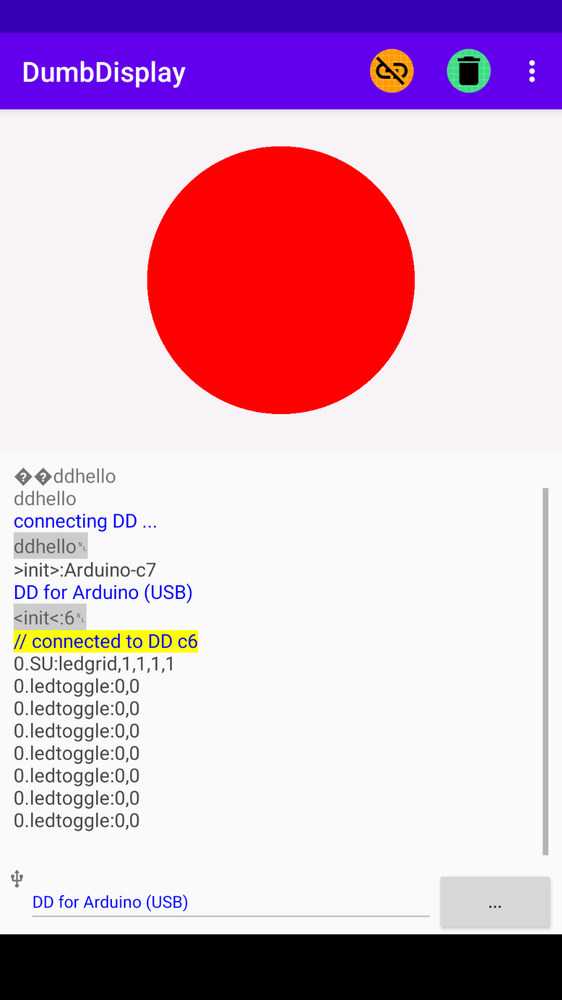|


```
#include "dumbdisplay.h"

// create the DumbDisplay object; assuming OTG (USB) connection with 115200 baud (default)
DumbDisplay dumbdisplay(new DDInputOutput());
LedGridDDLayer *led;

void setup() {
    // create a LED layer
    led = dumbdisplay.createLedGridLayer();
}

void loop() {
    led->toggle();
    delay(1000);
}
```
1) Declare a global [DumbDisplay](https://trevorwslee.github.io/ArduinoDumbDisplay/html/class_dumb_display.html) object, giving it a [DDInputOutput](https://trevorwslee.github.io/ArduinoDumbDisplay/html/class_d_d_input_output.html) object (an IO object) for communicating with DumbDisplay app  
2) Also, globally declare one or more [DDLayer](https://trevorwslee.github.io/ArduinoDumbDisplay/html/class_d_d_layer.html) objects. In this case, the `led` [LedGridDDLayer](https://trevorwslee.github.io/ArduinoDumbDisplay/html/class_led_grid_d_d_layer.html) object, which is for simulating a virtual LED.
3) In the `setup` block, create the globally declared layer objects via the DumbDisplay object.
4) Once created, the layer objects can be used in the `loop()` block. Like in this case, the `toggle()` method of the `led` layer object is called, effectively blinking the virtual LED every second. 

Since the sketch assumes USB connectivity to your Android phone, hence, the final step is to attach your microcontroller board to your Android phone via an OTG adapter. 

You may want to refer to my post [Blink Test With Virtual Display, DumbDisplay](https://www.instructables.com/Blink-Test-With-Virtual-Display-DumbDisplay/) for more description on such connection.

Notes:
* The DumbDisplay object will actually send text-based commands to DumbDisplay app to create layers (plus others)
* The layer object is simply a representation of the corresponding layer on the DumbDisplay app side
  -- most operations on the layer object actually sends text-based commands to DumbDisplay app
* As a result, action like creating a layer will block until a connection with DumbDisplay app is made
* If this "active" connection does not fit your use base, you may want to consider ["Passive" Connection](#passive-connection)  


|  |  |
|--|--|
|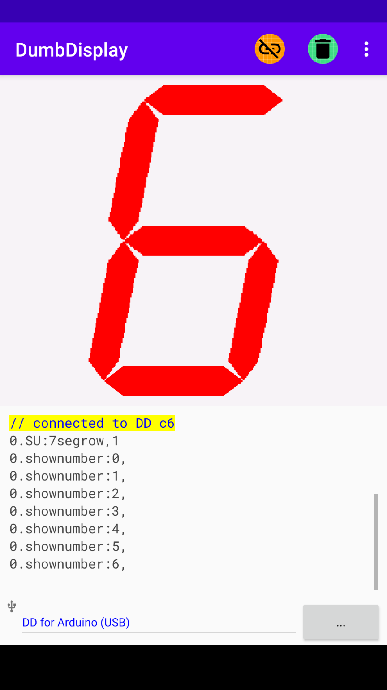|Another simple example is making use of virtual 7-segment display for counting (from 0 to 9) like `otg7segment` -- https://github.com/trevorwslee/Arduino-DumbDisplay/blob/master/examples/otg7segment/otg7segment.ino|

```
#include "dumbdisplay.h"

// create the DumbDisplay object; assuming USB connection with 115200 baud
DumbDisplay dumbdisplay(new DDInputOutput(115200));

// declare a 7-segment layer object, to be created in setup()
SevenSegmentRowDDLayer *sevenSeg;

void setup() {
    // create the 7-segment layer object, with only a single 7-segment digit
    sevenSeg = dumbdisplay.create7SegmentRowLayer();
}

void loop() {
    for (int digit = 0; digit < 10; digit++) {
        // show the digit on the 7-segment
        sevenSeg->showNumber(digit);

        // delay a second
        delay(1000);
   }
}
```


## Connectivity

Here is the list of all connection IO objects that you can use:

* Via Serial -- via OTG; you may want to refer to [Blink Test with Virtual Display, DumbDisplay](https://www.instructables.com/Blink-Test-With-Virtual-Display-DumbDisplay/) -- [DDInputOutput](https://trevorwslee.github.io/ArduinoDumbDisplay/html/class_d_d_input_output.html)
  ```
    #include "dumbdisplay.h"
    DumbDisplay dumbdisplay(new DDInputOutput(115200));
  ```
  - need to include `dumbdisplay.h` -- `#include "dumbdisplay.h"`
  - setup a `dumbdisplay` object -- `DumbDisplay dumbdisplay(new DDInputOutput())`
  - you **should not** be using `Serial` for other purposes
  - the default baud rate is 115200;  a lower baud rate, say 9600, may work better in some cases; **be reminded that** DumbDisplay app side also need be set to matching baud rate
* Via [`SoftwareSerial`](https://www.arduino.cc/en/Reference/softwareSerial) -- attached to a Bluetooth module like HC-06. For an example, you may want to refer to the post [Setup HC-05 and HC-06, for Wireless 'Number Invaders'](https://www.instructables.com/Setup-HC-05-and-HC-06-for-Wireless-Number-Invaders/) -- [DDSoftwareSerialIO](https://trevorwslee.github.io/ArduinoDumbDisplay/html/class_d_d_software_serial_i_o.html)
  ```
    #include "ssdumbdisplay.h"
    DumbDisplay dumbdisplay(new DDSoftwareSerialIO(new SoftwareSerial(2, 3), 115200));
  ```
  - need to include `ssdumbdisplay.h` -- `#include "ssdumbdisplay.h"` -- which internally includes `dumbdisplay.h`
  - setup a `dumbdisplay` object -- e.g. `DumbDisplay dumbdisplay(new DDSoftwareSerialIO(new SoftwareSerial(2, 3), 115200))`  
    - in this example, 2 and 3 are the pins used by `SoftwareSerial`
    - the default baud rate is 115200, which seems to work better from my own testing with HC-06; however, you may want to test using lower baud rate in case connection is not stable; this is especially true for HC-08, which connects via BLE. 
  - you **should not** be using that `SoftwareSerial` for other purposes
* Via **ESP32** `BluetoothSerial` -- [DDBluetoothSerialIO](https://trevorwslee.github.io/ArduinoDumbDisplay/html/class_d_d_bluetooth_serial_i_o.html)
  ```
    #include "esp32dumbdisplay.h"
    DumbDisplay dumbdisplay(new DDBluetoothSerialIO("ESP32"));
  ```
  - include `esp32dumbdisplay.h` -- `#include "esp32dumbdisplay.h"`
  - setup a `dumbdisplay` object -- e.g. `DumbDisplay dumbdisplay(new DDBluetoothSerialIO("ESP32"))`  
    - in the sample, "ESP32" is the name used by `BluetoothSerial`
  - you **should not** be using `BluetoothSerial` for other purposes
* Via **ESP32** `BLE` -- [DDBLESerialIO](https://trevorwslee.github.io/ArduinoDumbDisplay/html/class_d_d_b_l_e_serial_i_o.html)
  ```
    #include "esp32bledumbdisplay.h"
    DumbDisplay dumbdisplay(new DDBLESerialIO("ESP32BLE"));
  ```
  - include `esp32bledumbdisplay.h` -- `#include "esp32bledumbdisplay.h"`
  - setup a `dumbdisplay` object -- e.g. `DumbDisplay dumbdisplay(new DDBLESerialIO("ESP32BLE"))`  
    - in the sample, "ESP32BLE" is the name used by BLE
  - you **should not** be using ESP32's BLE for other purposes
  - be **warned** that `DDBLESerialIO` is slow; if classic Bluetooth is supported by microcontroller (like ESP32), choose `DDBluetoothSerialIO` instead 
* Via WIFI as a [`WiFiServer`](https://www.arduino.cc/en/Reference/WiFi) -- for ESP32 / ESP8266 / PicoW / Arduino UNO R4 Wifi -- [DDWiFiServerIO](https://trevorwslee.github.io/ArduinoDumbDisplay/html/class_d_d_wi_fi_server_i_o.html)  
  ```
    #include "wifidumbdisplay.h"
    const char* ssid = "wifiname";
    const char* password = "wifipassword";
    DumbDisplay dumbdisplay(new DDWiFiServerIO(ssid, password));
  ```
  - ESP01 is basically a ESP8266
  - WIFI credentials are passed to `WiFiServer`
  - by default, DumbDisplay will setup and log using `Serial` with baud rate 115200; and you should see serial monitor log lines like:
    ```
      binding WIFI <wifiname>
      binded WIFI <wifiname>
      listening on 192.168.1.134:10201 ...
    ```  
    where 192.168.1.134 is the IP of your microcontroller and 10201 is the port which is the default port

    if **nothing** is shown to the serial monitor, try calling `Serial.begin(115200)` manually, like
    ```
    void setup() {
      Serial.begin(115200);
      ...
    }
    ```
* Via *generic* `DD_SERIAL` -- possibly connected with Bluetooth module like HC-06 -- for Raspberry Pi Pico / Arduino Mega / STM32 -- [DDGenericIO](https://trevorwslee.github.io/ArduinoDumbDisplay/html/class_d_d_generic_i_o.html)
  <br>The essence is, you define the *generic* `DD_SERIAL` object before including `genericdumbdisplay.h`;  for examples:
  - `Raspberry Pi Pico` -- 8 ==> TX ; 9 ==> RX
    ```
    UART uart(8, 9, 0, 0);
    #define DD_SERIAL uart
    #include "genericdumbdisplay.h"
    DumbDisplay dumbdisplay(new DDGenericIO());
    ```  
  - `Arduino Mega` -- 17 ==> TX ; 16 ==> RX
    ```
    #define DD_SERIAL Serial2
    #include "genericdumbdisplay.h"
    DumbDisplay dumbdisplay(new DDGenericIO());
    ```
  - `STM32` -- PA3 (RX2) ==> TX ; PA2 (TX2) ==> RX
    ```
    HardwareSerial hs(USART2);
    #define DD_SERIAL hs
    #include "genericdumbdisplay.h"
    DumbDisplay dumbdisplay(new DDGenericIO());
    ```
  - `SoftwareSerial` -- 2 ==> TX ; 3 ==> RX
    ```
    #include <SoftwareSerial.h>
    SoftwareSerial ss(2, 3);
    #define DD_SERIAL ss
    #include "genericdumbdisplay.h"
    DumbDisplay dumbdisplay(new DDGenericIO());
    ```  

Note on using of `Serial`. If DumbDisplay will make connection using `Serial`, you certainly should not print to `Serial`. Nevertheless, if DumbDisplay is not set to make connection with `Serial`, you are free to use `Serial` for your logging purposes; but be aware that DumbDisplay itself might be logging to `Serial` in certain cases.    


## Samples

Here, several examples are presented demonstrating the basis of DumbDisplay. More samples will be shown when [DumbDisplay features](#features) are described in a bit more details in later sections.


| [Micro:bit](#sample----microbit) | [LEDs + "Bar Meter" + LCD](#sample----leds--bar-meter--lcd) | [Graphical [LCD]](#sample----graphical-lcd) |
|--|--|--|
|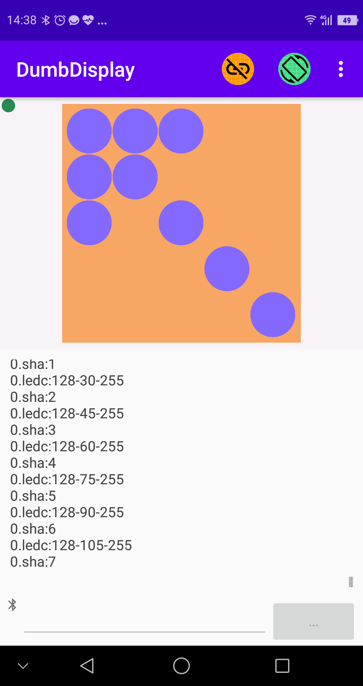|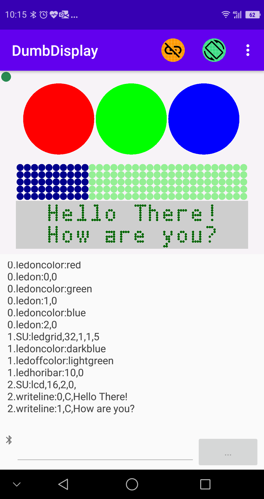|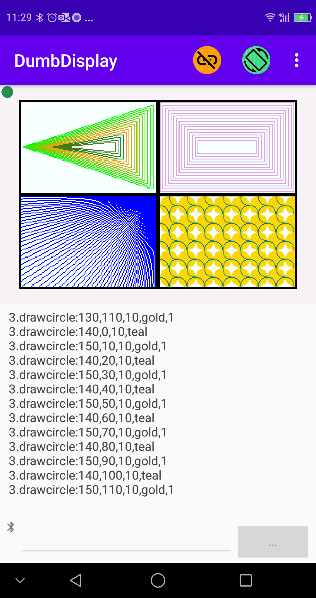|


### Sample -- *Micro:bit*

A more interesting sample would be like the one shown here, which shows how to use the [MbDDLayer](https://trevorwslee.github.io/ArduinoDumbDisplay/html/class_mb_d_d_layer.html) to simulate a Micro:bit.

https://github.com/trevorwslee/Arduino-DumbDisplay/blob/develop/samples/ddmb/ddmb.ino

```
#include "dumbdisplay.h"

// for connection
// . via OTG -- see https://www.instructables.com/Blink-Test-With-Virtual-Display-DumbDisplay/
// . via DumbDisplayWifiBridge -- see https://www.youtube.com/watch?v=0UhRmXXBQi8/
DumbDisplay dumbdisplay(new DDInputOutput());

MbDDLayer *mb;
int heading;

void setup() {
  // create Micro:bit layer
  mb = dumbdisplay.createMicrobitLayer();
  // set background color
  mb->backgroundColor(DD_HEX_COLOR(0xF4A460));
}

void loop() {
  // set LED color
  String ledColor = DD_RGB_COLOR(128, 15 * heading, 255);
  mb->ledColor(ledColor);

  // show arrow
  MbArrow arrow = static_cast<MbArrow>(heading);  
  mb->showArrow(arrow);

  heading++;
  if (heading == 8)
    heading = 0;
  delay(1000);
}
```

### Sample -- *LEDs + "Bar Meter" + LCD*

An even more interesting sample would be like the example shown here, which demonstrates how the [LedGridDDLayer](https://trevorwslee.github.io/ArduinoDumbDisplay/html/class_led_grid_d_d_layer.html) can be used.

https://github.com/trevorwslee/Arduino-DumbDisplay/blob/develop/samples/ddbarmeter/ddbarmeter.ino

```
#include "dumbdisplay.h"

// for connection
// . via OTG -- see https://www.instructables.com/Blink-Test-With-Virtual-Display-DumbDisplay/
// . via DumbDisplayWifiBridge -- see https://www.youtube.com/watch?v=0UhRmXXBQi8/
DumbDisplay dumbdisplay(new DDInputOutput());

void setup() {
  // configure to "auto pin (layout) layers" in the vertical direction -- V(*)
  dumbdisplay.configAutoPin(DD_AP_VERT);
  
  // create a LED layer
  LedGridDDLayer *led = dumbdisplay.createLedGridLayer(3, 1);
  // turn on LEDs
  led->onColor("red");
  led->turnOn(0, 0);
  led->onColor("green");
  led->turnOn(1, 0);
  led->onColor("blue");
  led->turnOn(2, 0);

  // create another LED layers that will be used for "horizontal bar-meter"
  // with max "bar" size 32
  LedGridDDLayer *barmeter = dumbdisplay.createLedGridLayer(32, 1, 1, 5);
  barmeter->onColor("darkblue");
  barmeter->offColor("lightgreen");
  // set the "bar" to 10 (ie. 10 of total 32)
  barmeter->horizontalBar(10);

  // create a LCD layer
  LcdDDLayer * lcd = dumbdisplay.createLcdLayer();
  // write to LCD write messages (as lines)
  // notice that "C" means center-align
  lcd->writeLine("Hello There!", 0, "C");
  lcd->writeLine("How are you?", 1, "C");
}

void loop() {
}
```


### Sample -- *Graphical [LCD]*

There is a graphical [LCD] layer [GraphicalDDLayer](https://trevorwslee.github.io/ArduinoDumbDisplay/html/class_graphical_d_d_layer.html) which is "derived" from the Turtle layer (i.e. in addition to the general features of graphical LCD, it also has Turtle-like features)

https://github.com/trevorwslee/Arduino-DumbDisplay/blob/develop/samples/ddgraphical/ddgraphical.ino

```
#include "dumbdisplay.h"

// for connection
// . via OTG -- see https://www.instructables.com/Blink-Test-With-Virtual-Display-DumbDisplay/
// . via DumbDisplayWifiBridge -- see https://www.youtube.com/watch?v=0UhRmXXBQi8/
DumbDisplay dumbdisplay(new DDInputOutput());

void setup() {
  // create 4 graphical [LCD] layers
  GraphicalDDLayer *pLayer1 = dumbdisplay.createGraphicalLayer(151, 101);
  GraphicalDDLayer *pLayer2 = dumbdisplay.createGraphicalLayer(151, 101);
  GraphicalDDLayer *pLayer3 = dumbdisplay.createGraphicalLayer(151, 101);
  GraphicalDDLayer *pLayer4 = dumbdisplay.createGraphicalLayer(151, 101);

  // set fill screen with color
  pLayer1->fillScreen("azure");
  pLayer2->fillScreen("azure");
  pLayer3->fillScreen("azure");
  pLayer4->fillScreen("azure");

  //  configure to "auto pin" the 4 layers
  // -- end result of DD_AP_XXX(...) is the layout spec "H(V(0+1)+V(2+3))"
  // -- . H/V: layout direction
  // -- . 0/1/2/3: layer id
  dumbdisplay.configAutoPin(DD_AP_HORI_2(
                              DD_AP_VERT_2(pLayer1->getLayerId(), pLayer2->getLayerId()),
                              DD_AP_VERT_2(pLayer3->getLayerId(), pLayer4->getLayerId())));

  // draw triangles
  int left = 0;
  int right = 150;
  int top = 0;
  int bottom = 100;
  int mid = 50;
  for (int i = 0; i < 15; i++) {
    left += 3;
    top += 3;
    right -= 3;
    bottom -= 3;
    int x1 = left;
    int y1 = mid;
    int x2 = right;
    int y2 = top;
    int x3 = right;
    int y3 = bottom;
    int r = 25 * i;
    int g = 255 - (10 * i);
    int b = 2 * i;
    pLayer1->drawTriangle(x1, y1, x2, y2, x3, y3, DD_RGB_COLOR(r, g, b));
  }

  // draw lines
  for (int i = 0;; i++) {
    int delta = 5 * i;
    int x1 = 150;
    int y1 = 0;
    int x2 = -150 + delta;
    int y2 = delta;
    pLayer2->drawLine(x1, y1, x2, y2, "blue");
    if (x2 > 150)
      break;
  }

  // draw rectangles
  for (int i = 0; i < 15; i++) {
    int delta = 3 * i;
    int x = delta;
    int y = delta;
    int w = 150 - 2 * x;
    int h = 100 - 2 * y;
    pLayer3->drawRect(x, y, w, h, "plum");
  }

  // draw circles
  int radius = 10;
  for (int i = 0; i < 8; i++) {
    int x = 2 * radius * i;
    for (int j = 0; j < 6; j++) {
      int y = 2 * radius * j;
      int r = radius;
      pLayer4->drawCircle(x, y, r, "teal");
      pLayer4->fillCircle(x + r, y + r, r, "gold");
    }
  }
}

void loop() {
}
```


## More Samples

| [Nested "auto pin" layers](#sample----nested-auto-pin-layers)  | [Manual "pin" layers (LEDs + Turtle)](#sample----manual-pin-layers-leds--turtle) | ["Layer feedback"](#sample----layer-feedback) |
|--|--|--|
||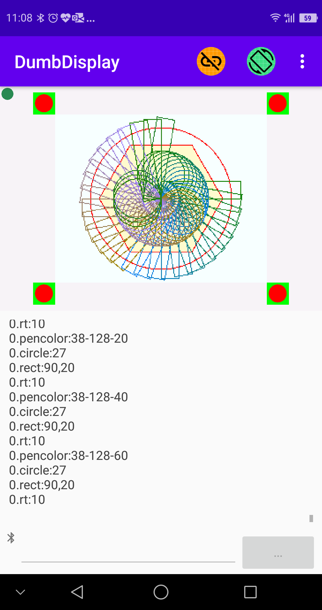|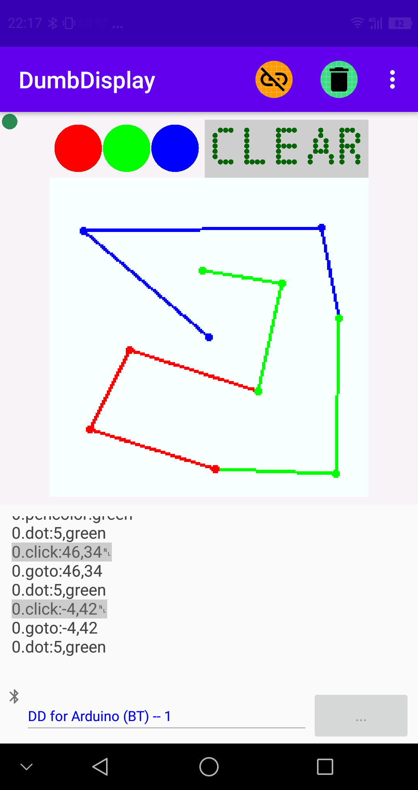|


### Sample -- *Nested "auto pin" layers*

Auto pinning of layers (more details later) is not restricted to a single direction. In fact, it can be nested, like

https://github.com/trevorwslee/Arduino-DumbDisplay/blob/develop/samples/ddautopin/ddautopin.ino

```
#include "dumbdisplay.h"

// for connection
// . via OTG -- see https://www.instructables.com/Blink-Test-With-Virtual-Display-DumbDisplay/
// . via DumbDisplayWifiBridge -- see https://www.youtube.com/watch?v=0UhRmXXBQi8/
DumbDisplay dumbdisplay(new DDInputOutput());

LedGridDDLayer *rled;
LedGridDDLayer *gled;
LedGridDDLayer *bled;
LedGridDDLayer *hmeter;
LedGridDDLayer *vmeter;
LcdDDLayer *lcd;

int count = 20;

void setup() {
  // create R + G + B LED layers
  rled = dumbdisplay.createLedGridLayer();
  gled = dumbdisplay.createLedGridLayer();
  bled = dumbdisplay.createLedGridLayer();

  // create LED layers that will be used for "horizontal bar-meter"
  hmeter = dumbdisplay.createLedGridLayer(2 * count, 1, 1, 5);
  // create LED layers that will be used for "vertical bar-meter"
  vmeter = dumbdisplay.createLedGridLayer(1, 2 * count, 5, 1);
  
  // create a LCD layers with 2 rows of 16 characters
  lcd = dumbdisplay.createLcdLayer(16, 2);
  
  // configure to "auto pin" the different layers 
  // -- end result of DD_AP_XXX(...) is the layout spec "H(V(0+1+2)+V(3+5)+4)"
  // -- . H/V: layout direction
  // -- . 0/1/2/3/4/5: layer id
  dumbdisplay.configAutoPin(DD_AP_HORI_3(
                              DD_AP_VERT_3(rled->getLayerId(), gled->getLayerId(), bled->getLayerId()),
                              DD_AP_VERT_2(hmeter->getLayerId(), lcd->getLayerId()),
                              vmeter->getLayerId()));
        
  // setup RGB leds color and turn them on
  rled->onColor("red");
  gled->onColor("green");
  bled->onColor("blue");
  rled->turnOn();
  gled->turnOn();
  bled->turnOn();
  
  // set "bar meters" colors
  hmeter->onColor("blue");
  hmeter->offColor("yellow");
  hmeter->backgroundColor("black");
  vmeter->onColor("green");
  vmeter->offColor("lightgray");
  vmeter->backgroundColor("blue");
  
  // set LCD colors and print out something
  lcd->pixelColor("red");
  lcd->bgPixelColor("lightgreen");
  lcd->backgroundColor("black");
  lcd->print("hello world");  
  lcd->setCursor(0, 1);
  lcd->print("how are you?");
}

void loop() {
  delay(1000);
  if (random(2) == 0) {
    lcd->scrollDisplayLeft();
    count--;
  } else {  
    lcd->scrollDisplayRight();
    count++;
  }
  hmeter->horizontalBar(count);
  vmeter->verticalBar(count);
  if (random(2) == 0)
    rled->toggle();
  if (random(2) == 0)
    gled->toggle();
  if (random(2) == 0)
    bled->toggle();
}
```


### Sample -- *Manual "pin" layers (LEDs + Turtle)*

To showcase Turtle layer [TurtleDDLayer](https://trevorwslee.github.io/ArduinoDumbDisplay/html/class_turtle_d_d_layer.html), as well as the more controller way of "pinning" layers

https://github.com/trevorwslee/Arduino-DumbDisplay/blob/develop/samples/ddpinturtle/ddpinturtle.ino

```
#include "dumbdisplay.h"

// for connection
// . via OTG -- see https://www.instructables.com/Blink-Test-With-Virtual-Display-DumbDisplay/
// . via DumbDisplayWifiBridge -- see https://www.youtube.com/watch?v=0UhRmXXBQi8/
DumbDisplay dumbdisplay(new DDInputOutput());

TurtleDDLayer *turtle = NULL;
int r = random(0, 256);
int g = 128;
int b = 0;

void setup() {
  // create a Turtle layer with size 240 x 190
  turtle = dumbdisplay.createTurtleLayer(240, 190);
  // setup Turtle layer
  turtle->backgroundColor("azure");
  turtle->fillColor("lemonchiffon");
  turtle->penSize(1);
  turtle->penFilled(true);
  // initially draw something on the Turtle layer (will change some settings)
  turtle->centeredPolygon(70, 6, true);
  turtle->penFilled(false);
  turtle->circle(80, true);

  // create 4 LEDs -- left-top, right-top, right-bottom and left-bottom 
  LedGridDDLayer* ltLed = dumbdisplay.createLedGridLayer();
  LedGridDDLayer* rtLed = dumbdisplay.createLedGridLayer();
  LedGridDDLayer* rbLed = dumbdisplay.createLedGridLayer();
  LedGridDDLayer* lbLed = dumbdisplay.createLedGridLayer();

  // set LEDs background color
  ltLed->backgroundColor("green");
  rtLed->backgroundColor("green");
  rbLed->backgroundColor("green");
  lbLed->backgroundColor("green");

  // turn ON the LEDs
  ltLed->turnOn();
  rtLed->turnOn();
  rbLed->turnOn();
  lbLed->turnOn();

  // config "pin frame" to be 290 units x 250 units
  // 290: 25 + 240 + 25
  // 240: 25 + 190 + 25
  dumbdisplay.configPinFrame(290, 240);

  // pin top-left LED @ (0, 0) with size (25, 25)
  dumbdisplay.pinLayer(ltLed, 0, 0, 25, 25);
  // pin top-right LED @ (265, 0) with size (25, 25)
  dumbdisplay.pinLayer(rtLed, 265, 0, 25, 25);
  // pin right-bottom LED @ (265, 215) with size (25, 25)
  dumbdisplay.pinLayer(rbLed, 265, 215, 25, 25);
  // pin left-bottom LED @ (0, 215) with size (25, 25)
  dumbdisplay.pinLayer(lbLed, 0, 215, 25, 25);

  // pin Turtle @ (25, 25) with size (240, 190)
  dumbdisplay.pinLayer(turtle, 25, 25, 240, 190);
}

void loop() {
  delay(1000);
  turtle->penColor(DD_RGB_COLOR(r, g, b));
  turtle->circle(27);
  turtle->rectangle(90, 20);
  turtle->rightTurn(10);
  b = b + 20;
  if (b > 255) {
      b = 0;
      r = random(0, 256);
  }
}
```

### Sample -- *"Layer feedback"*

This very simple doodle sample shows how the "layer feedback" mechanism (more details later) can be used to route user interaction (clicking) of layer to Arduino.

https://github.com/trevorwslee/Arduino-DumbDisplay/blob/develop/samples/dddoodle/dddoodle.ino

```
#include "dumbdisplay.h"

// for connection
// . via OTG -- see https://www.instructables.com/Blink-Test-With-Virtual-Display-DumbDisplay/
// . via DumbDisplayWifiBridge -- see https://www.youtube.com/watch?v=0UhRmXXBQi8/
DumbDisplay dumbdisplay(new DDInputOutput());

int dotSize = 5;
const char* penColor = "red";
TurtleDDLayer* pTurtleLayer = NULL;
LcdDDLayer* pLcdLayer = NULL;
LedGridDDLayer* pLedGridLayer = NULL;

void FeedbackHandler(DDLayer* pLayer, DDFeedbackType type, int x, int y) {
    if (pLayer == pLcdLayer) {
        // clicked the "clear" button
        pLayer->backgroundColor("white");
        Reset();
        delay(100);
        pLayer->backgroundColor("lightgray");
    } else if (pLayer == pLedGridLayer) {
        // clicked one of the 3 color options
        const char* color = NULL;
        if (x == 0)
            color = "red";
        else if (x == 1)    
            color = "green";
        else if (x == 2)    
            color = "blue";
        if (color != NULL) {
            pLedGridLayer->turnOff(x, 0);
            delay(100);
            pLedGridLayer->onColor(color);
            pLedGridLayer->turnOn(x, 0);
            penColor = color;
            pTurtleLayer->penColor(penColor);
            pTurtleLayer->dot(dotSize, penColor);
        }
    } else {
        // very simple doodle
        pTurtleLayer->goTo(x, y);
        pTurtleLayer->dot(dotSize, penColor);
    }
}

void Reset() {
    pTurtleLayer->clear();
    pTurtleLayer->penSize(2);
    pTurtleLayer->penColor(penColor);
    pTurtleLayer->home(false);
    pTurtleLayer->dot(dotSize, penColor);
}


void setup() {
    // use a Turtle layer for very simple doodle
    pTurtleLayer = dumbdisplay.createTurtleLayer(201, 201);
    pTurtleLayer->setFeedbackHandler(FeedbackHandler, "fs");
    pTurtleLayer->backgroundColor("azure");
    pTurtleLayer->fillColor("lemonchiffon");

    // use a LED layer for the "clear" button
    pLcdLayer = dumbdisplay.createLcdLayer(5, 1);   
    pLcdLayer->setFeedbackHandler(FeedbackHandler);
    pLcdLayer->backgroundColor("lightgray");
    pLcdLayer->print("CLEAR");

    // use a LED-grid layers for the 3 color options -- red, green and blue 
    pLedGridLayer = dumbdisplay.createLedGridLayer(3);
    pLedGridLayer->setFeedbackHandler(FeedbackHandler);
    pLedGridLayer->onColor("red");
    pLedGridLayer->turnOn(0);
    pLedGridLayer->onColor("green");
    pLedGridLayer->turnOn(1);
    pLedGridLayer->onColor("blue");
    pLedGridLayer->turnOn(2);
 
    // layout the different layers
    dumbdisplay.configAutoPin(DD_AP_VERT_2(
                                DD_AP_HORI_2(
                                    pLedGridLayer->getLayerId(),
                                    pLcdLayer->getLayerId()),
                                pTurtleLayer->getLayerId()));


    Reset();
}

void loop() {
    // give DD a chance to capture "feedback"
    DDYield();
}
```

Notes:
* DumbDisplay library will work cooperatively with your code; therefore, do give DumbDisplay library chances to do its work. Please call `DDYield()` and/or `DDDelay()` appropriately whenever possible. 


## More OTG Examples

| [RGB "Sliders"](#example----rgb-sliders) |  ["Tunnel" for RESTful](#example----tunnel-for-restful) | ["Tunnel" for Web Image](#example----tunnel-for-web-image) | 
|--|--|--|
|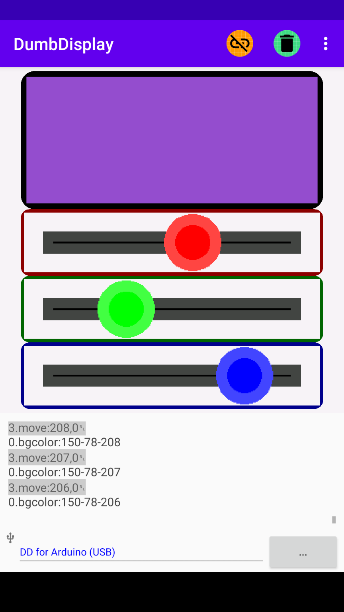|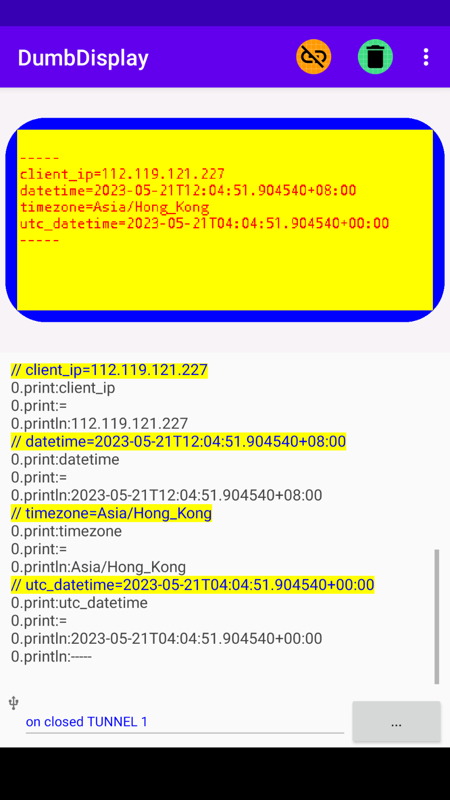|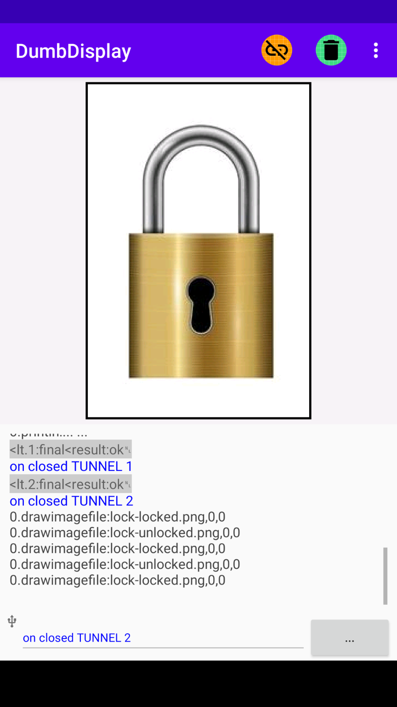|


### Example -- *RGB "Sliders"*

This example make use of the virtual Joystick layers with "feedback" to realize three "sliders" for selecting the three primary colors, to be render with a virtual graphical [LCD] layer -- https://github.com/trevorwslee/Arduino-DumbDisplay/blob/master/examples/otgrgb/otgrgb.ino

```
#include "dumbdisplay.h"

// create the DumbDisplay object; assuming USB connection with 115200 baud
DumbDisplay dumbdisplay(new DDInputOutput());

// declare a graphical layer object to show the selected color; to be created in setup()
GraphicalDDLayer *colorLayer;
// declare the R "slider" layer
JoystickDDLayer *rSliderLayer;
// declare the G "slider" layer
JoystickDDLayer *gSliderLayer;
// declare the B "slider" layer
JoystickDDLayer *bSliderLayer;

int r = 0;
int g = 0;
int b = 0;

void setup() {
  // create the "selected color" layer
  colorLayer = dumbdisplay.createGraphicalLayer(350, 150);
  colorLayer->border(5, "black", "round", 2);
  
  // create the R "slider" layer
  rSliderLayer = dumbdisplay.createJoystickLayer(255, "hori", 0.5);
  rSliderLayer->border(3, "darkred", "round", 1);
  rSliderLayer->colors("red", DD_RGB_COLOR(0xff, 0x44, 0x44), "black", "darkgray");

  // create the G "slider" layer
  gSliderLayer = dumbdisplay.createJoystickLayer(255, "hori", 0.5);
  gSliderLayer->border(3, "darkgreen", "round", 1);
  gSliderLayer->colors("green", DD_RGB_COLOR(0x44, 0xff, 0x44), "black", "darkgray");

  // create the B "slider" layer
  bSliderLayer = dumbdisplay.createJoystickLayer(255, "hori", 0.5);
  bSliderLayer->border(3, "darkblue", "round", 1);
  bSliderLayer->colors("blue", DD_RGB_COLOR(0x44, 0x44, 0xff), "black", "darkgray");

  // "auto pin" the layers vertically
  dumbdisplay.configAutoPin(DD_AP_VERT);

  colorLayer->backgroundColor(DD_RGB_COLOR(r, g, b));
}

void loop() {
  int oldR = r;
  int oldG = g;
  int oldB = b;
  
  const DDFeedback*  fb;

  fb = rSliderLayer->getFeedback();
  if (fb != NULL) {
    r = fb->x;
  }
  fb = gSliderLayer->getFeedback();
  if (fb != NULL) {
    g = fb->x;
  }
  fb = bSliderLayer->getFeedback();
  if (fb != NULL) {
    b = fb->x;
  }

  if (r != oldR || g != oldG || b != oldB) {
    colorLayer->backgroundColor(DD_RGB_COLOR(r, g, b));
  }
}
```

### Example -- *"Tunnel" for RESTful*

This example should demonstrate how to use "tunnel" (more details later) to access the Internet for simple things, like calling RESTful api -- https://github.com/trevorwslee/Arduino-DumbDisplay/blob/master/examples/otgrest/otgrest.ino

```
#include "dumbdisplay.h"

// create the DumbDisplay object; assuming OTG (USB) connection with 115200 baud
DumbDisplay dumbdisplay(new DDInputOutput());

// declare a graphical layer object, to be created in setup()
GraphicalDDLayer *graphicalLayer;
// declare a tunnel object, to be created in setup()
JsonDDTunnel *restTunnel;

void setup() {
  // setup a "graphical" layer with size 350x150
  graphicalLayer = dumbdisplay.createGraphicalLayer(350, 150);
  graphicalLayer->backgroundColor("yellow");        // set background color to yellow
  graphicalLayer->border(10, "blue", "round");      // a round blue border of size 10  
  graphicalLayer->penColor("red");                  // set pen color

  // setup a "tunnel" to get "current time" JSON data; suggest to specify the buffer size to be the same as fields wanted
  restTunnel = dumbdisplay.createFilteredJsonTunnel("http://worldtimeapi.org/api/timezone/Asia/Hong_Kong", "client_ip,timezone,datetime,utc_datetime", true, 4);  

  graphicalLayer->println();
  graphicalLayer->println("-----");
  while (!restTunnel->eof()) {           // check that not EOF (i.e. something still coming)
    while (restTunnel->count() > 0) {    // check that received something
      String fieldId;
      String fieldValue;
      restTunnel->read(fieldId, fieldValue);                // read whatever received
      dumbdisplay.writeComment(fieldId + "=" + fieldValue); // write out that whatever to DD app as comment
      if (fieldId == "client_ip" || fieldId == "timezone" || fieldId == "datetime" || fieldId == "utc_datetime") {
        // if the expected field, print it out
        graphicalLayer->print(fieldId);
        graphicalLayer->print("=");
        graphicalLayer->println(fieldValue);
      }
    }
  }
  graphicalLayer->println("-----");
}

void loop() {
}
```

### Example -- *"Tunnel" for Web Image*

This example should demonstrate how to use "tunnel" to download images from the Web (to your phone's storage) and display them -- "blink" with images rather than LED -- https://github.com/trevorwslee/Arduino-DumbDisplay/blob/master/examples/otgwebimage/otgwebimage.ino
```
#include "dumbdisplay.h"

DumbDisplay dumbdisplay(new DDInputOutput());


GraphicalDDLayer *graphical;
SimpleToolDDTunnel *tunnel_unlocked;
SimpleToolDDTunnel *tunnel_locked;

void setup() {
  // create a graphical layer for drawing the web images to
  graphical = dumbdisplay.createGraphicalLayer(200, 300);


  // create tunnels for downloading web images ... and save to your phone ... optionally: in order to send less duplicated data (in URL), create a map entry for R
  tunnel_unlocked = dumbdisplay.createImageDownloadTunnel("https://${R=raw.githubusercontent.com/trevorwslee/Arduino-DumbDisplay/master/screenshots}/lock-unlocked.png", "lock-unlocked.png");
  tunnel_locked = dumbdisplay.createImageDownloadTunnel("https://${R}/lock-locked.png", "lock-locked.png");
}

bool locked = false;
void loop() {
  // get result whether web image downloaded .. 0: downloading; 1: downloaded ok; -1: failed to download 
  int result_unlocked = tunnel_unlocked->checkResult();
  int result_locked = tunnel_locked->checkResult();

  int result;
  const char* image_file_name;
  if (locked) {
    image_file_name = "lock-locked.png";
    result = result_locked;
  } else {
    image_file_name = "lock-unlocked.png";
    result = result_unlocked;
  }
  if (result == 1) {
    graphical->drawImageFile(image_file_name);
  } else if (result == 0) {
    // downloading
    graphical->clear();
    graphical->setCursor(0, 10);
    graphical->println("... ...");
    graphical->println(image_file_name);
    graphical->println("... ...");
  } else if (result == -1) {
    graphical->clear();
    graphical->setCursor(0, 10);
    graphical->println("XXX failed to download XXX");
  }
  locked = !locked;
  delay(1000);
}
```
The original URLs to download the images should have been
* `https://raw.githubusercontent.com/trevorwslee/Arduino-DumbDisplay/master/screenshots/lock-unlocked.png`
* `https://raw.githubusercontent.com/trevorwslee/Arduino-DumbDisplay/master/screenshots/lock-locked.png`

However, in the sketch, the URLs are encoded as
* `https://${R=raw.githubusercontent.com/trevorwslee/Arduino-DumbDisplay/master/screenshots}/lock-unlocked.png`
* `https://${R}/lock-locked.png`

in order to reduce the total amount of data to send to DumbDisplay app. This encoding is a better choice for microcontroller like Arduino UNO which is not as powerful as others like ESP32.

Basically, `${R=raw.githubusercontent.com/trevorwslee/Arduino-DumbDisplay/master/screenshots}` not only specifies that portion of URL to be `raw.githubusercontent.com/trevorwslee/Arduino-DumbDisplay/master/screenshots`. It also tells to set up a mapping from `R` to `raw.githubusercontent.com/trevorwslee/Arduino-DumbDisplay/master/screenshots` as well. As a result `https://${R}/lock-locked.png` rewrites to `https://raw.githubusercontent.com/trevorwslee/Arduino-DumbDisplay/master/screenshots/lock-locked.png`.

Please refer to the section [Using "Tunnel" to Download Images from the Web](#using-tunnel-to-download-images-from-the-web) for more details on saving images to the phone.


# Selected Demos

Before talking about the various [DumbDisplay features](#features), here is a couple of selected demos that might interested you


|[Turn ESP32-CAM into a Snapshot Taker, for Selfies and Time Lapse Pictures](https://www.instructables.com/Turn-ESP32-CAM-Into-a-Snapshot-Taker-for-Selfies-a/)|[Sliding Puzzle 'Next Move' Suggesting Simple DL Model With ESP32 TensorFlow Lite](https://www.instructables.com/Sliding-Puzzle-Next-Move-Suggesting-Simple-DL-Mode/)|[Simple Arduino Framework Raspberry Pi Pico / ESP32 TFT LCD Photo Frame Implementation With Photos Downloaded From the Internet Via DumbDisplay](https://www.instructables.com/Simple-Arduino-Framework-Raspberry-Pi-Pico-ESP32-T/)|
|--|--|--|
|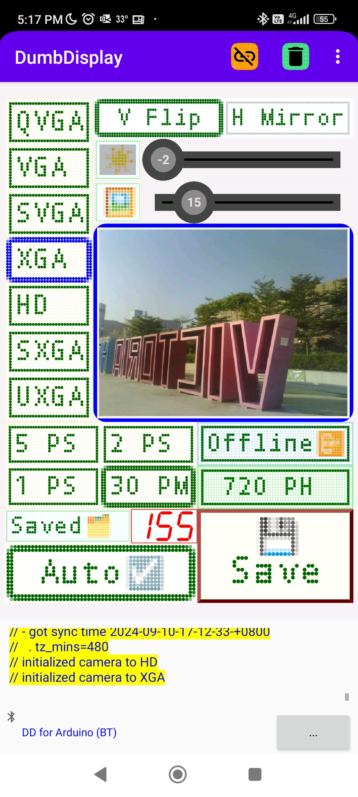|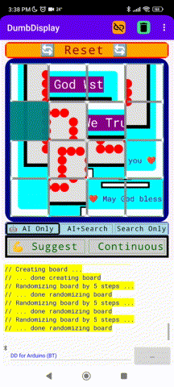|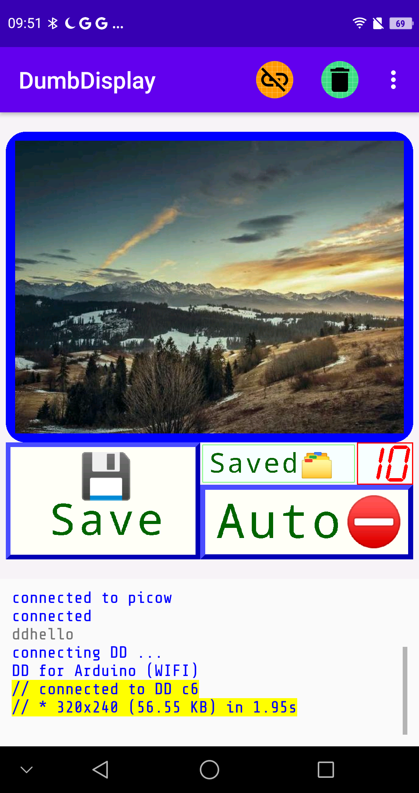|

|[Arduino Experiment of Ultrasonic Sensor, ToF Laser Range Sensor and Servo Motor, With Raspberry Pi Pico and DumbDisplay](https://www.instructables.com/Arduino-Experiment-of-Ultrasonic-Sensor-ToF-Laser-/)|[Mnist Dataset -- From Training to Running With ESP32 / ESP32S3](https://www.instructables.com/Mnist-Dataset-From-Training-to-Running-With-ESP32-/)|[NEO-7M U-BLOX GPS Module Experiment](https://www.instructables.com/NEO-7M-U-BLOX-GPS-Module-Experiment/)|
|--|--|--|
|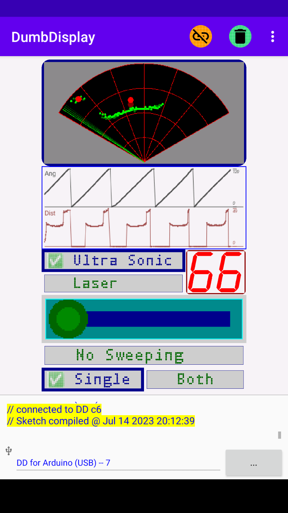||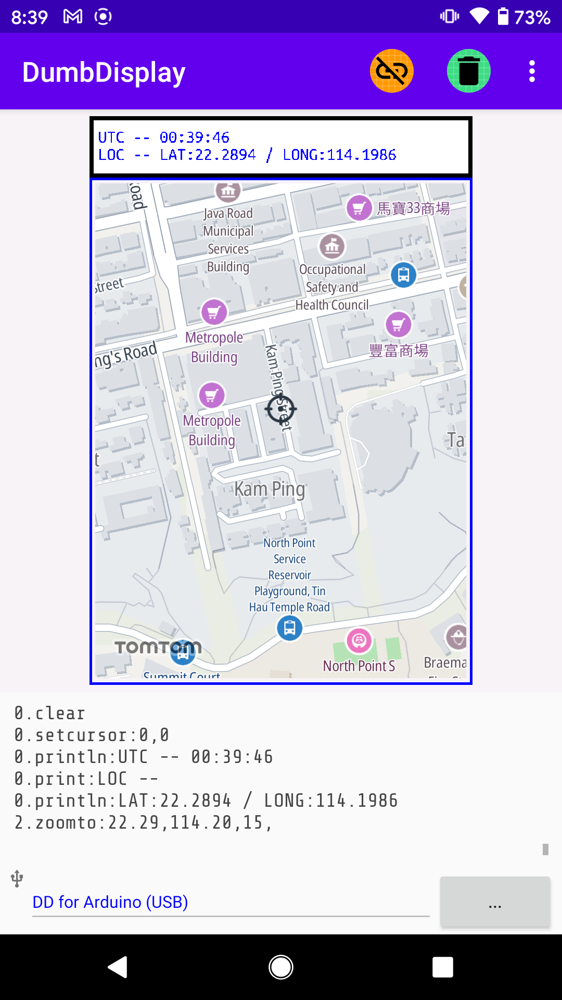|


# Features


## DumbDisplay "Feedback" Mechanism

You can also try out "layer feedback" from DumbDisplay like

https://github.com/trevorwslee/Arduino-DumbDisplay/blob/master/samples/ddonoffloopmb/ddonoffloopmb.ino


```
#include "dumbdisplay.h"

// for connection, please use DumbDisplayWifiBridge -- https://www.youtube.com/watch?v=0UhRmXXBQi8
DumbDisplay dumbdisplay(new DDInputOutput());

MbDDLayer* pMbLayer = NULL;

void setup() {
    // create the MB layer with size 10x10
    pMbLayer = dumbdisplay.createMicrobitLayer(10, 10);
    // enable "feedback" -- auto flashing the clicked area
    pMbLayer->enableFeedback("fa");
}

void loop() {
    // check for "feedback"
    const DDFeedback *pFeedback = pMbLayer->getFeedback();
    if (pFeedback != NULL) {
        // act upon "feedback"
        pMbLayer->toggle(pFeedback->x, pFeedback->y); 
    }
}
```

Alternatively, can setup "callback" function to handle "feedback" passively, like

https://github.com/trevorwslee/Arduino-DumbDisplay/blob/master/samples/ddonoffmb/ddonoffmb.ino

```
#include "ssdumbdisplay.h"

// assume HC-06 connected, to pin 2 and 3
DumbDisplay dumbdisplay(new DDSoftwareSerialIO(new SoftwareSerial(2, 3), 115200, true));

MbDDLayer* pMbLayer = NULL;

void FeedbackHandler(DDLayer* pLayer, DDFeedbackType type, const DDFeedback& feedback) {
    // got a click on (x, y) ... toggle it
    pMbLayer->toggle(feedback.x, feedback.y);
}

void setup() {
    // create the MB layer with size 10x10
    pMbLayer = dumbdisplay.createMicrobitLayer(10, 10);
    // setup "callback" function to handle "feedback" passively -- auto flashing the clicked area
    pMbLayer->setFeedbackHandler(FeedbackHandler, "fa");
}

void loop() {
    // give DD a chance to capture feedback
    DDYield();
}
```

Please note that DumbDisplay library will check for "feedback" in several occasions:
* before every get "feedback" with `getFeedback()`
* after every send of command
* once when `DDYield()` is called
* during the "wait loop" of `DDDelay()`
* calling "tunnel" to check for EOF


## DumbDisplay "Tunnel"


By using DumbDisplay "tunnels", even Arduino UNO can get simple data from the Internet via DumbDisplay app. The above "tunnel" for RESTful example should already show-case this feature.

```
#include "dumbdisplay.h"

DumbDisplay dumbdisplay(new DDInputOutput());

JsonDDTunnel *restTunnel;

void setup() {
  // setup a "tunnel" to get "current time" JSON data; suggest to specify the buffer size to be the same as fields wanted
  restTunnel = dumbdisplay.createFilteredJsonTunnel("http://worldtimeapi.org/api/timezone/Asia/Hong_Kong", "client_ip,timezone,datetime,utc_datetime", true, 4);  
  while (!restTunnel->eof()) {           // check that not EOF (i.e. something still coming)
    while (restTunnel->count() > 0) {    // check that received something
      String fieldId;
      String fieldValue;
      restTunnel->read(fieldId, fieldValue);                // read whatever received
      dumbdisplay.writeComment(fieldId + "=" + fieldValue); // write out that whatever to DD app as comment
      if (fieldId == "client_ip" || fieldId == "timezone" || fieldId == "datetime" || fieldId == "utc_datetime") {
        // if the expected field ...
        ...
      }
    }
  }
}

void loop() {
}
```

In case a "tunnel" reaches EOF, and needs be reinvoked:

```
restTunnel->reconnect();
```

In case a "tunnel" finishes all its tasks in the middle of the sketch, it can be released in order for Arduino to claim back resources:

```
dumbdisplay.deleteTunnel(restTunnel);
```

Here is some description on how JSON response to JSON data is converted and how to loop getting the JSON data:

* you construct `JsonDDTunnel` "tunnel" and make REST request like:
  ```
  pTunnel = dumbdisplay.createJsonTunnel("http://worldtimeapi.org/api/timezone/Asia/Hong_Kong"); 
  ```
* you [asynchronously] read JSON data from the "tunnel" a piece at a time;
  e.g. if the JSON is
  ```
  { 
    "full_name": "Bruce Lee",
    "name":
      {
        "first": "Bruce",
        "last": "Lee"
      },
    "gender": "Male",
    "age": 32
  }
  ```  
 
  then, the following JSON pieces will be returned:
  * `full_name` = `Bruce Lee`
  * `name.first` = `Bruce`
  * `name.last` = `Lee`
  * `gender` = `Male`
  * `age` = `32`
  
  notes:
  * all returned values will be text
  * control characters like `\r` not supported
  * since lots of data could be acquired,  `Serial` connection might not be suitable due to it's small buffer size
  
* use `count()` to check if the "tunnel" has anything to read, and use `read()` to read what got, like:
  ```
  while (!restTunnel->eof()) {
    while (restTunnel->count() > 0) {
      String fieldId;
      String fieldValue;
      restTunnel->read(fieldId, fieldValue);  // fieldId and fieldValue combined is a piece of JSON data 
      dumbdisplay.writeComment(fieldId + "=" + fieldValue);
    }
  }  
  ```
  note that `eof()` will check whether everything has returned and read before signaling EOF.


## Service "Tunnels"

Service "tunnels" is a kind of "tunnels" that aids getting specific external data, by making use of your Android's phone features.

The two service "tunnels" are:
* "Date-time service tunnel" for getting current date-time from your Android phone
  ```
    BasicDDTunnel *datetimeTunnel = dumbdisplay.createDateTimeServiceTunnel();
    datetimeTunnel->reconnectTo("now");
    ...
    String datetime;
    if (datetimeTunnel->readLine(datetime)) {
      ...
    } 
  ```
  Note that other than getting "now" date-time as text, you can use "now-millis" to get date-time in milli-seconds.  
  The complete "now" sample sketch: https://github.com/trevorwslee/Arduino-DumbDisplay/blob/master/samples/ddnow/ddnow.ino
* "GPS service tunnel" for getting your Android phone's location
  In order for DumbDisplay app to access your phone's GPS service, permission is needed;
  please select DumbDisplay app menu item ***Settings*** and click the ***Location Service button***.
  ```
    GpsServiceDDTunnel *gpsTunnel = dumbdisplay.createGpsServiceTunnel();
    gpsTunnel->reconnectForLocation();
    ...
    DDLocation location;
    if (gpsTunnel->readLocation(location)) {
      ...
    }  
  ```   
  The complete "here" sample sketch: https://github.com/trevorwslee/Arduino-DumbDisplay/blob/master/samples/ddhere/ddhere.ino.
* TensorFlow Lite object detection demo service "tunnel"
  ```
    ObjectDetetDemoServiceDDTunnel *object_detect_tunnel = dumbdisplay.createObjectDetectDemoServiceTunnel();
    ...
    object_detect_tunnel->reconnectForObjectDetect("downloaded.png");
    ...
    DDObjectDetectDemoResult objectDetectResult;
    if (object_detect_tunnel->readObjectDetectResult(objectDetectResult)) {
      dumbdisplay.writeComment(String(". ") + objectDetectResult.label);
      int x = objectDetectResult.left;
      int y = objectDetectResult.top;
      int w = objectDetectResult.right - objectDetectResult.left;
      int h = objectDetectResult.bottom - objectDetectResult.top;
      graphical->drawRect(x, y, w, h, "green");
      graphical->drawStr(x, y, objectDetectResult.label, "yellow", "a70%darkgreen", 32);
    }
  ```
|  |  |
|--|--|
|For the complete demo, please refer to [Arduino AI Fun With TensorFlow Lite, Via DumbDisplay](https://www.instructables.com/Arduino-AI-Fun-With-TensorFlow-Lite-Via-DumbDispla/).|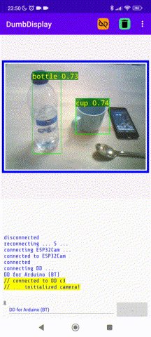|
  


## "Device Dependent View" Layers

A "device dependent view" layer is a layer that embeds a specific kind of Android View as a DD Layer. And hence, it's rendering is totally controlled by the Android View itself. DumbDisplay app simply provides a place where it will reside.

Nevertheless, do note that:
* DDLayer's margin, border, padding, as well as visibility, will work as expected.
* The "device dependent view" DD Layer size -- of the "opening" for the Android view -- is just like graphical LCD layer that requires explicit width-height specification; but note that the width-height specified basically only dictates the aspect-ratio of the "opening", it's actual size is adjusted according to where it will be placed.

There are three "device dependent view" layers available.

### Terminal Layer

[`TerminalDDLayer`](https://trevorwslee.github.io/ArduinoDumbDisplay/html/class_terminal_d_d_layer.html) is a simple "device dependent view" layer that simulates the function of a simple serial terminal (monitor) like DumbDisplay app itself. You create such layer like

A sample use is: https://github.com/trevorwslee/Arduino-DumbDisplay/blob/master/projects/ddgpsmap/ddgpsmap.ino

The sample demonstrates how to read simple GPS location data from module like NEO-7M U-BLOX, formats and output the data
to a `TerminalDDLayer`:

```
  ...
  #define NEO_RX 6   // RX pin of NEO-7M U-BLOX
  #define NEO_TX 5   // TX pin of NEO-7M U-BLOX
  SoftwareSerial gpsSerial(NEO_TX, NEO_RX);
  GpsSignalReader gpsSignalReader(gpsSerial);
  DumbDisplay dumbdisplay(new DDInputOutput(115200));
  TerminalDDLayer* terminal;
  void setup() {
    gpsSerial.begin(9600);
    terminal = dumbdisplay.createTerminalLayer(600, 800);
  }
  GpsSignal gpsSignal;
  void loop() {
    if (gpsSignalReader.readOnce(gpsSignal)) {
      terminal->print("- utc: ");
      terminal->print(gpsSignal.utc_time);
      terminal->print(" ... ");
      if (gpsSignal.position_fixed) {
        terminal->print("position fixed -- ");
        terminal->print("lat:");
        terminal->print(gpsSignal.latitude);
        terminal->print(" long:");
        terminal->print(gpsSignal.longitude);
        ...
      }
    }
  }
```

The above sketch assumes using OTG USB adaptor for connection to Android DumbDisplay app. And as a result, bringing the above GPS experiment outdoor should be easier. Not only the microcontroller board can be powered by your Android phone, you can observe running traces of the sketch with your phone as well.


### WebView Layer

You can use the Android WebView to display HTML code that renders the layer's content as a HTML page by using [`WebViewDDLayer`](https://trevorwslee.github.io/ArduinoDumbDisplay/html/class_web_view_d_d_layer.html).

```
#include "dumbdisplay.h"
DumbDisplay dumbdisplay(new DDInputOutput());
WebViewDDLayer *webView;
void setup() {
    webView = dumbdisplay.createWebViewLayer(300, 300);
    webView->loadUrl("https://trevorwslee.github.io/DumbCalculator/");
}
void loop() {
}
```
 
|  |  |
|--|--|
|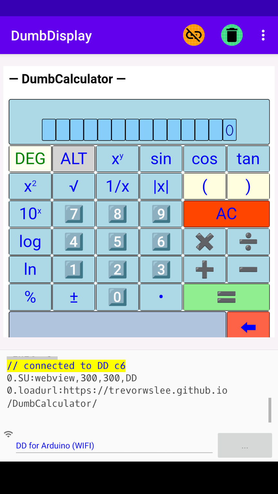|Note that https://trevorwslee.github.io/DumbCalculator/ is a live simple WASM calculator implemented using Rust|


Other than loading from URL, WebView can load HTML code as well; e.g.
```
...
    webView = dumbdisplay.createWebViewLayer(300, 300);

    String html = 
        "<html>"
          "<h1>My Web Page</h1>"
          "<p>This is a paragraph.</p>"
          "<p>This is another paragraph.</p>"
        "</html>";

    // it is IMPORTANT to remove any newline characters from the html
    html.replace("\n", "");   

    // load the html into the WebView layer
    webView->loadHtml(html); 
...
```
***IMPORTANT: before calling `loadHtml()`, remove any newline characters from the HTML code first***

Android WebView also provides some interfacing capabilities between the Android app (DumbDisplay) and the HTML code.
> Please refer to Android's [WebAppInterface](https://developer.android.com/develop/ui/views/layout/webapps/webview)
And such interfacing is bridged by DumbDisplay with the followings
* A special JavaScript object, default is `DD`, that enables sending, from the HTML code, "feedback" as other layers
  - `DD.feedback(type, x, y)` -- as "feedback" from regular DD layers, `x` and `y` are Integers that you can use however you like; `type` can be
    - `click`
    - `double_click`
    - `long_press`
    - `move`
    - `up`
    - `down`
  - `DD.feedbackWithText(type, x, y, text)` -- like `DD.feedback()` but additionally with "feedback" `text` that you can use however you like; e.g.
    ```
    <button onclick='javascript:DD.feedbackWithText("click",0,0,"Hi, there!")'/>
    ```
* The `WebViewDDLayer` has a method `execJs()` that you can use to call JavaScript function defined in the HTML code; e.g.
  ```
  webView->execJs("turnOnOff(true)");  // turnOnOff() is a JavaScript function defined in the HTML code
  ```     
  > Please refer to Android's [evaluateJavascript()](https://developer.android.com/reference/android/webkit/WebView)

Sorry! Very likely, `WebViewDDLayer` will not work correctly for less-capable boards like Arduino Uno, Nano, etc, mostly due to limit on connection channel, like `Serial`.


|  |  |
|--|--|
|You may want to refer to the example `otgblink_ex` -- https://github.com/trevorwslee/Arduino-DumbDisplay/blob/master/examples/otgblink_ex/otgblink_ex.ino|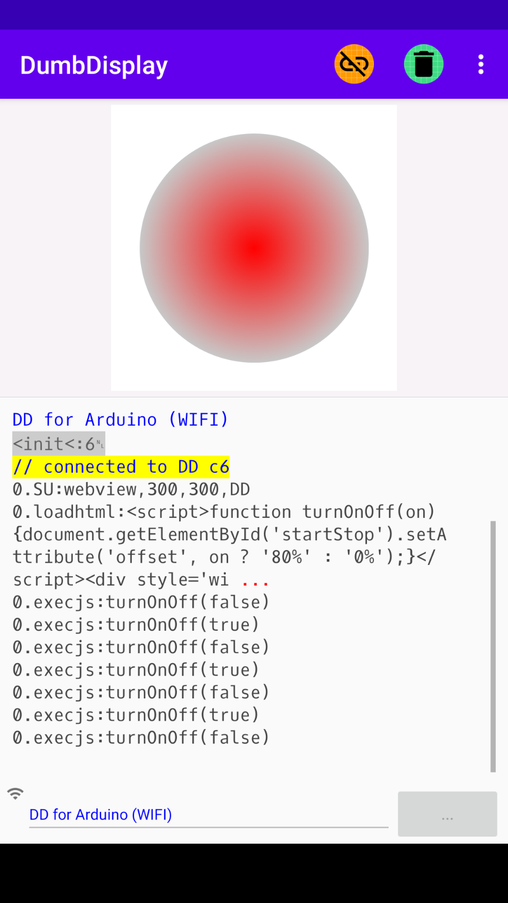|


### TomTom Map Layer


Another "device dependent view" layer is [`TomTomMapDDLayer`](https://trevorwslee.github.io/ArduinoDumbDisplay/html/class_tom_tom_map_d_d_layer.html).

|  |  |
|--|--|
|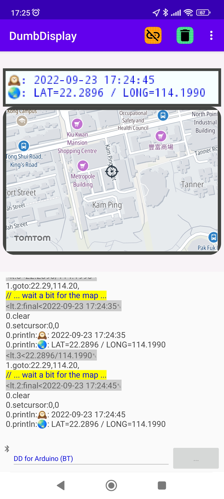|For demonstration, the above "now/here" samples are combined into a more "useful" sketch that also makes use of this Android View to show the GPS location retrieved, continuously. The complete "nowhere" sample is https://github.com/trevorwslee/Arduino-DumbDisplay/blob/master/samples/ddnowhere/ddnowhere.ino|


### DumbDisplay Window Layer

A "device dependent view" layer that provide simple support for connecting to other microcontroller's DumbDisplay in a "window" can be realized with `DumbDisplayWindowDDLayer`, like
```
...
DumbDisplayWindowDDLayer *ddwin_layer;
...
void setup() {
  ...
  ddwin_layer = dumbdisplay.createDumbDisplayWindowLayer(250, 200);
  ddwin_layer->border(3, "blue", "round", 2);
  ddwin_layer->padding(3);
  ddwin_layer->connect("WIFI", "My Device", "192.168.0.155");
  ...
}
...
```
where arguments to `connect()` are:
* 'Device type', like `WIFI`, `BT` or `LE`
* 'Device name'
* 'Device address' -- for `WIFI`, the IP address of the target microcontroller to connect to;
                      for `BT` / `LE`, the target microcontroller Bluetooth module's address like `84:0D:8E:D2:90:EE`

Note that the target microcontroller is supposed to be an independent DumbDisplay-enabled sketch that doesn't rely on being "contained", it should be fully connectable like other DumbDisplay sketches.
For `WIFI`, you should be able to see the WIFI IP address by connecting the target microcontroller to Serial monitor; likewise, you can find the `BT` / `LE` Bluetooth module address by connecting the microcontroller to Serial monitor as well. 

One use case of `DumbDisplayWindowDDLayer` can be like -- a microcontroller implementing a remote control for a remote car with DumbDisplay, and additionally, a ESP32Cam put in the front of the remote car for 
streaming live-pictures to the remote control independently.


### RTSP Client Layer

A "device dependent view" layer that supports connecting to a RTSP video stream as a layer, with the help of the `rtsp-client-android` library -- https://github.com/alexeyvasilyev/rtsp-client-android

For example:
```
...
RtspClientDDLayer* rtspClient;
...
void setup() {
  ...
  rtspClient = dumbdisplay->createRtspClient(160, 90);
  rtspClient->border(3, "blue", "round");  
  rtspClient->padding(3);
  ...
  rtspClient->start("rtsp://192.168.0.154");
  delay(5 * 60);
  rtspClient->stop();
  ...
}

```
|  |  | 
|--|--|
|For example usage of RTSP Client Layer, you may refer to the example `amb82_facerecog` as mentioned by [Amb82 Mini Arduino Framework Face Recognization Demo GUI With DumbDisplay](https://www.instructables.com/Amb82-Mini-Arduino-Framework-Face-Recognization-De/)|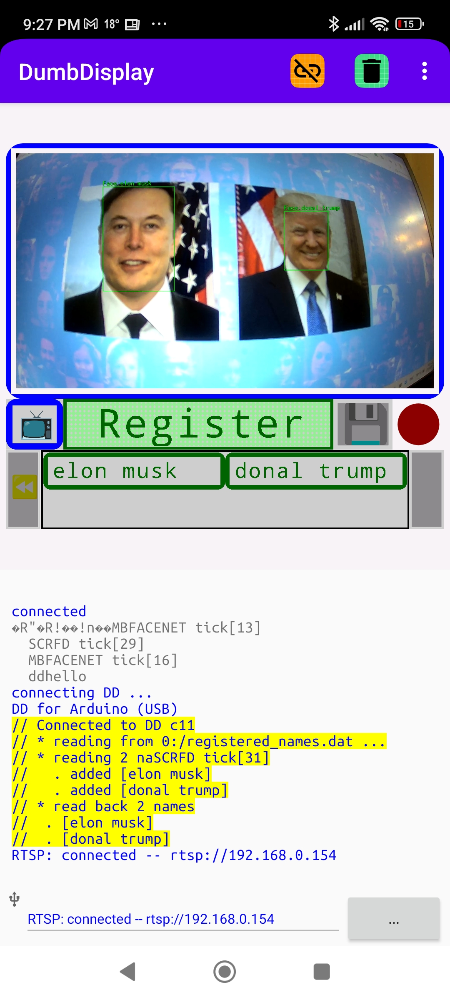|


## Downloadable Font Support

Layers like [`GraphicalDDLayer`](https://trevorwslee.github.io/ArduinoDumbDisplay/html/class_graphical_d_d_layer.html) can use specified font for rendering text; however, there are not many fonts in normal Android installments.
DumbDisplay app supports the use of  selective downloadable font open sourced by Google, namely, B612, Cutive, Noto Sans, Oxygen, Roboto, Share Tech, Spline Sans and Ubuntu.

```
  ...
  GraphicalDDLayer *graphical = dumbdisplay.createGraphicalLayer(150, 300);
  ...
  graphical->setTextFont("DL::Roboto");
  ...
```

In order to ensure that these Google's fonts are ready for DumbDisplay app when they are used, please check ***Settings | Pre-Download Fonts***

For a complete sample sketch of using downloadable font, please refer to https://github.com/trevorwslee/Arduino-DumbDisplay/blob/master/examples/otgfonts/otgfonts.ino


## Positioning of Layers

By default, layers are stacked one by one, with the one created first on the top of the stack. Each layer will be automatically stretched to fit the DumbDisplay screen, with the aspect ratio kept unchanged.

This stacking behavior is not suitable for all cases. In fact, I would say that this default behavior is not suitable for many cases, except for the most simple case when you only have a single layer.

Actually, two mechanisms to "pin" the layers on DumbDisplay are provided -- automatic and manual.

The automatic pinning of layers is the easier. You only need to call the DumbDisplay method `configAutoPin()` once to pin the layers, like
```
    dumbdisplay.configAutoPin(DD_AP_VERT_2(
                                DD_AP_HORI_2(
                                    pLedGridLayer->getLayerId(),
                                    pLcdLayer->getLayerId()),
                                pTurtleLayer->getLayerId()));
```
`DD_AP_HORI_2()` / `DD_AP_VERT_2()` macro pins 2 layers side by side horizontally / vertically. It accepts 2 arguments, with each one either a layer id, or another **DD_AP_XXX** macro. 

The different **DD_AP_XXX** macros are
* **DD_AP_HORI_`N`()** : Horizontally layout `N` layers (ids) or nested **DD_AP_XXX**; with **DD_AP_HORI** layouts all layers horizontally
* **DD_AP_VERT_`N`()** : Vertically layout `N` layers (ids) or nested **DD_AP_XXX**; with **DD_AP_VERT** layouts all layers vertically
* **DD_AP_STACK_`N`()** : Stack `N` layers (ids) or nested **DD_AP_XXX**; with **DD_AP_STACK** stacks all layers
* **DD_AP_PADDING()** : It accepts padding sizes -- left, top, right and bottom -- and a layer (id) (or nested **DD_AP_XXX**)   
* **DD_AP_SPACER()** : It is an invisible "spacer" layer with the given dimension -- width and height

The manual way of pinning layers is a bit more complicated. First, a "pin frame" needs be defined with a fixed size; by default, the size is 100 by 100. To change the "pin frame" fixed size, use the DumbDisplay method `configPinFrame()`. 

On the "pin frame", the different layers are explicitly pinned.

For example
```
  // config "pin frame" to be 290 units x 250 units
  // 290: 25 + 240 + 25
  // 240: 25 + 190 + 25
  dumbdisplay.configPinFrame(290, 240);

  // pin top-left LED @ (0, 0) with size (25, 25)
  dumbdisplay.pinLayer(ltLed, 0, 0, 25, 25);
  // pin top-right LED @ (265, 0) with size (25, 25)
  dumbdisplay.pinLayer(rtLed, 265, 0, 25, 25);
  // pin right-bottom LED @ (265, 215) with size (25, 25)
  dumbdisplay.pinLayer(rbLed, 265, 215, 25, 25);
  // pin left-bottom LED @ (0, 215) with size (25, 25)
  dumbdisplay.pinLayer(lbLed, 0, 215, 25, 25);

  // pin Turtle @ (25, 25) with size (240, 190)
  dumbdisplay.pinLayer(turtle, 25, 25, 240, 190);
```
The DumbDisplay method `pinLayer` accepts 5 arguments. The first argument is the layer to pin. The rest four arguments define the rectangular area on the "pin frame" to pin the layer to -- the four arguments are "left-top" corner and the "width-height" of the rectangular area.

As a matter of fact, the "auto pin" mechanism can be used in conjunction with the manual pinning mechanism. The method to used is `pinAutoPinLayers`.

To get a feel, you may want to refer to the video [**Raspberry Pi Pico playing song melody tones, with DumbDisplay control and keyboard input**](https://www.youtube.com/watch?v=l-HrsJXIwBY) 

|  |  |
|--|--|
|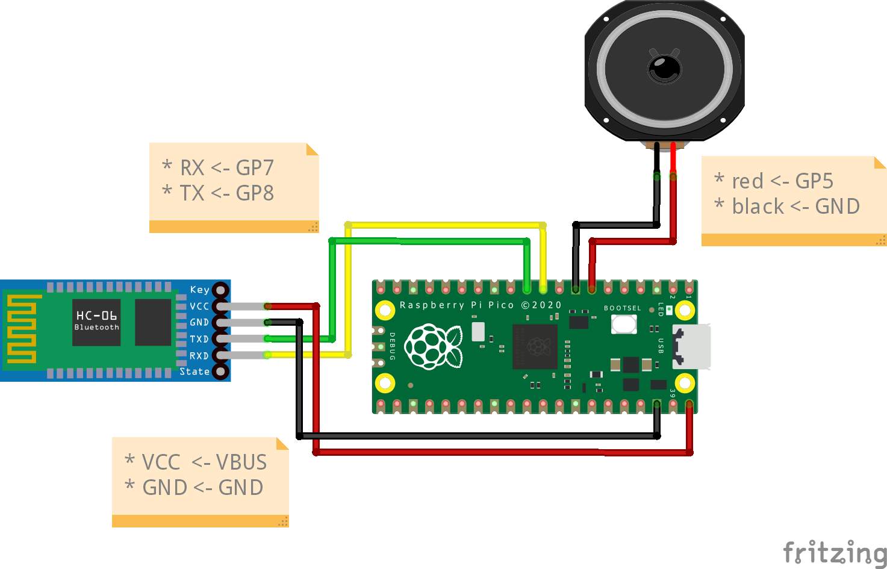|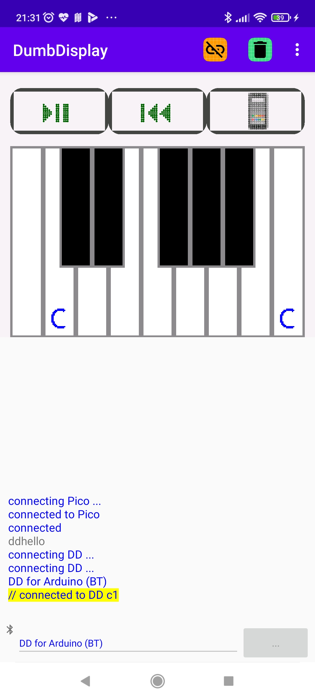|

Going back to "auto pin". In fact, there is a builder for such "auto pin" config -- [DDAutoPinConfig](https://trevorwslee.github.io/ArduinoDumbDisplay/html/class_d_d_auto_pin_config.html)

Using it should be apparent. Hopefully, some example should be sufficient.

Example 1:
```
  dumbdisplay->configAutoPin(DDAutoPinConfig('V').
                              beginGroup('H').
                                  addSpacer(1, 1).
                                  addLayer(pLedGridLayer).
                                  addSpacer(2, 1).
                                  addLayer(pLcdLayer).
                                  addSpacer(1, 1).
                              endGroup().
                              addLayer(pTurtleLayer).
                              build());
```
is equivalent to
```
  dumbdisplay->configAutoPin(DD_AP_VERT_2(
                              DD_AP_HORI_5(
                                  DD_AP_SPACER(1, 1),
                                  pLedGridLayer->getLayerId(),
                                  DD_AP_SPACER(2, 1),
                                  pLcdLayer->getLayerId(),
                                  DD_AP_SPACER(1, 1)),
                              pTurtleLayer->getLayerId()));
```

Example 2:
```
    dumbdisplay.configAutoPin(
      DDAutoPinConfig('V').
        beginGroup('H').
          addLayer(plotterLayer).
          beginGroup('V').
            addLayer(rLayer).addLayer(gLayer).addLayer(bLayer). 
          endGroup().
        endGroup().
        beginGroup('S').
          addLayer(colorLayer).
          beginPaddedGroup('H', 50, 200, 50, 200).
            addLayer(r7Layer).addLayer(g7Layer).addLayer(b7Layer).
          endPaddedGroup().
        endGroup().
        beginGroup('H').
          addLayer(whiteLayer).addLayer(blackLayer).
        endGroup().
        build()
    );
```
is equivalent to
```
    dumbdisplay.configAutoPin(
      DD_AP_VERT_3(
        DD_AP_HORI_2(
          plotterLayer->getLayerId(),
          DD_AP_VERT_3(rLayer->getLayerId(), gLayer->getLayerId(), bLayer->getLayerId())
        ),
        DD_AP_STACK_2(
          colorLayer->getLayerId(),
          DD_AP_PADDING(50, 200, 50, 200,
            DD_AP_HORI_3(r7Layer->getLayerId(), g7Layer->getLayerId(), b7Layer->getLayerId()))
        ),
        DD_AP_HORI_2(whiteLayer->getLayerId(), blackLayer->getLayerId())
      )  
    );
```

You can choose which one is more convenient for you!


## Record and Playback Commands

It is apparent that turning on LEDs, drawing on graphical LCDs, etc, by sending text-based commands is not particularly efficient. Indeed, screen flickering is a commonplace, especial when there are lots of activities.

In order to relieve this flickering situation a bit, it is possible to freeze DumbDisplay's screen during sending bulk of commands:
* `dumbdisplay.recordLayerCommands()` -- start recording commands (freeze DumbDisplay screen)
* `dumbdisplay.playbackLayerCommands()` -- end recording commands and playback the recorded commands (unfreeze Dumbdisplay screen)

A sample sketch demonstrates that this DumbDisplay feature can help; the sample is adapted from one that shows off Arduino UNO with Joystick shield connecting to a OLED display: https://cyaninfinite.com/interfacing-arduino-joystick-shield-with-oled-display

Instead of posting the sample sketch here, please find it with the link: https://github.com/trevorwslee/Arduino-DumbDisplay/blob/master/projects/joystick/joystick.ino

| Arduino UNO with Joystick shield | DumbDisplay |
|--|--|
||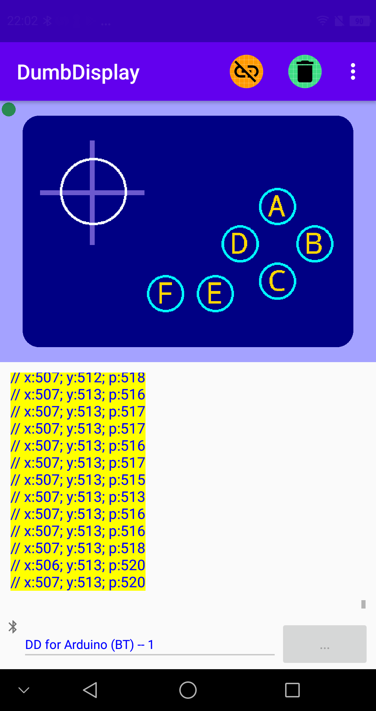|


If you are interested, you may want to watch the video **Arduino JoyStick Shield and DumbDisplay** -- https://www.youtube.com/watch?v=9GYrZWXHfUo


## Survive DumbDisplay App Reconnection

In certain "stateless" cases, like DumbDisplay is simply used as means to show values, it is possible for DumbDisplay to be able to meaningfully reconnect after DumbDisplay app disconnect / restart. (Do note that DumbDisplay app does not persist "state" information.)

The only missing piece is the layout of the different layers. And this missing piece can be "regained" by recording the layout commands, and automatically playback when DumbDisplay app reconnects.

To do this, you simply need to enclose the "layer setup" code with the record/playback mechanism mentioned previously. 

More precisely, you will need to use the following methods of DumbDisplay object:
* `dumbdisplay.recordLayerSetupCommands()` -- start recording "setup" commands (freeze DumbDisplay screen)
* `dumbdisplay.playbackLayerSetupCommands("<setup-id>")` -- end recording "setup" commands and playback the recorded "setup" commands. **The argument `"<setup-id>"`, is the name for DumbDisplay app to identify and persist the "setup" commands. When reconnect, those "setup" commands will be played back automatically.**

E.g.
```
  // start recording the commands to setup DD (app side)
  dumbdisplay.recordLayerSetupCommands();

  // create a 7-seg layer for 4 digits
  sevenSeg = dumbdisplay.create7SegmentRowLayer(4);
  sevenSeg->border(15, "darkblue", "round");
  sevenSeg->padding(10);
  sevenSeg->resetSegmentOffColor(DD_HEX_COLOR(0xeeddcc));

  // stop recording and play back the recorded commands
  // more importantly, a "id" is given so that
  // the records commands can be reused during restart of DD app 
  dumbdisplay.playbackLayerSetupCommands("up4howlong");
```

For the complete sketch of the above example, please refer to https://github.com/trevorwslee/Arduino-DumbDisplay/blob/master/samples/ddup4howlong/ddup4howlong.ino


## More "Feedback" Options

Besides the usual `CLICK`, `DOUBLECLICK` and `LONGPRESS` "feedback" types are also possible.

For example, if want to modify previously mentioned *"Layer feedback"* sample to only clear dots on double-check, can change the code in `FeedbackHandler()`

from 

```
    if (pLayer == pLcdLayer) {
        // clicked the "clear" button
        pLayer->backgroundColor("white");
        Reset();
        delay(100);
        pLayer->backgroundColor("lightgray");
    }
```

to

```
    if (pLayer == pLcdLayer) {
        // clicked the "clear" button
        if (type == DDFeedbackType::DOUBLECLICK) {
          pLayer->backgroundColor("white");
          Reset();
          delay(100);
          pLayer->backgroundColor("lightgray");
        }
    }
```

Additionally, if want to make use of the "auto repeat" option, can change code like:

from 

```
pTurtleLayer->setFeedbackHandler(FeedbackHandler, "fs");
```

to

```
pTurtleLayer->setFeedbackHandler(FeedbackHandler, "fs:lprpt50");
```

This simple change will enable "auto repeat" option -- as long as still pressed, long press feedback will auto repeat every 50ms.

Better yet, if want the dragging to be trigger as so as possible, can use the option like

```
pTurtleLayer->setFeedbackHandler(FeedbackHandler, "fs:rpt50");
```

Like "lprpt50", "rpt50" enables "auto repeat" option. The difference is that "rpt50" will simulate dragging -- clicking continuously.

As a reference, you may want to refer to the servo project -- https://github.com/trevorwslee/Arduino-DumbDisplay/blob/master/projects/servo/servo.ino 

For a brief explanation of the sketch, you may want to watch the video [**ESP8266 Servo Arduino experiment, subsequently, with simple DumbDisplay UI**](https://www.youtube.com/watch?v=pgfL_qwj8cQ)


| ESP8266 with Servo | DumbDisplay |
|--|--|
||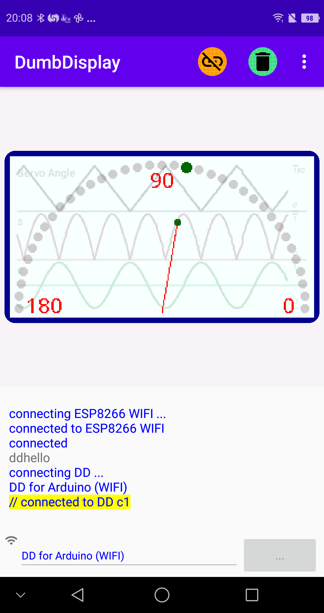|

As a matter of fact, there is more a realistic dragging option. To enable such "drag" option, specify it like
```
pGrahpicalLayer->setFeedbackHandler(FeedbackHandler, "fs:drag");
```
***Note that such "drag" will always end with a "feedback" with x and y both -1.***

In case you want to specify the "end" X/Y value, say as -9999, you can do so by using option like `"fs:drag-9999"`, like. 
```
pTurtleLayer->setFeedbackHandler(FeedbackHandler, "fs:drag-9999");
```

|  |  |
|--|--|
|For a complete example, please refer to the sketch as shown in the YouTube -- [Building a DL model for the Mnist Dataset, to building an Arduino Sketch for ESP32S3 (also ESP32)](https://www.youtube.com/watch?v=cL1-5BKJu30) The drawing of the hand-written digit is basically triggered by "drag" "feedbacks" ||


If you prefer to detect pressing of layer over clicking, you can do so like:

```
void setup() {
  ...
  pLayer->enableFeedback(":press");  // can be like "fs:press"
  ...
}
void loop() {
  ...
  fb = pLayer->getFeedback();
  if (fb != NULL) {
    if (fb->type == DDFeedbackType::UP) {
      dumbdisplay.writeComment("UP");
    } else if (fb->type == DDFeedbackType::DOWN) {
      dumbdisplay.writeComment("DOWN");
    }
  }
  ...
}
```

This "feedback" setup will keep you informed when layer pressing starts ("DOWN") and ends ("UP"), and it is useful if your UI design calls for more complicated user behavior like -- click one layer when another layer is pressed.


## Idle Callback and ESP32 Deep Sleep

It is possible to setup ESP32 to go to deep sleep when DumbDisplay library detects "idle", after, say, 15 seconds:

```
void IdleCallback(long idleForMillis, DDIdleConnectionState connectionState) {
  if (idleForMillis > 15000) {  // go to sleep if idle for more than 15 seconds
    esp_sleep_enable_timer_wakeup(5 * 1000 * 1000);  // wake up in 5 seconds
    esp_deep_sleep_start();
  }
}
...
void setup() {
  ...
  dumbdisplay.setIdleCallback(IdleCallback);
  ...
}
```

Please note that there are two situations DumbDisplay are considered "idle":
1) When initially wait for connection to DumbDisplay app.
2) When trying to reconnect after lost of connection with DumbDisplay app. 


For reference, you may want to refer to the example as shown by the video [**ESP32 Deep Sleep Experiment using Arduino with DumbDisplay**](https://www.youtube.com/watch?v=a61hRLIaqy8) 

Instead of relying on "idle" callback, you may want to consider ["Passive" Connection](#passive-connection), to be described later.


## Using "Tunnel" to Download Images from the Web

It is possible to download image from the Web, save it to your phone, and draw it out to a graphical DD Layer.

This is done via an "image download tunnel" that you can create like

```
pTunnel = dumbdisplay.createImageDownloadTunnel("https://placekitten.com/680/480", "downloaded.png");
```

As preparation, you will need to grant DumbDisplay app permission to access your phone's storage.

|  |  |
|--|--|
|Select the menu item ***settings*** and click the button ***media storage***. This will trigger Android to ask for permission on behalf of DumbDisplay app, to access your phone's picture storage.|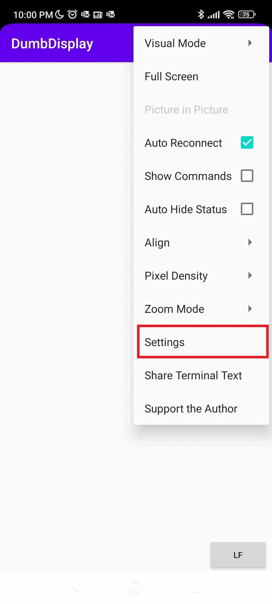|

Once permission granted, DumbDisplay app will create a private folder, and write some little sample resources there, like image `dumbdisplay.png`. From now on, DumbDisplay will access the folder for any image files that it will need to read / write.

|  |  |
|--|--|
|You can browse to the private folder using some "File Manager" app (like [***Files*** by ***Marc apps & software***](https://play.google.com/store/apps/details?id=com.marc.files&hl=en)) -- `Android/data/nobody.trevorlee.dumbdisplay/files/`|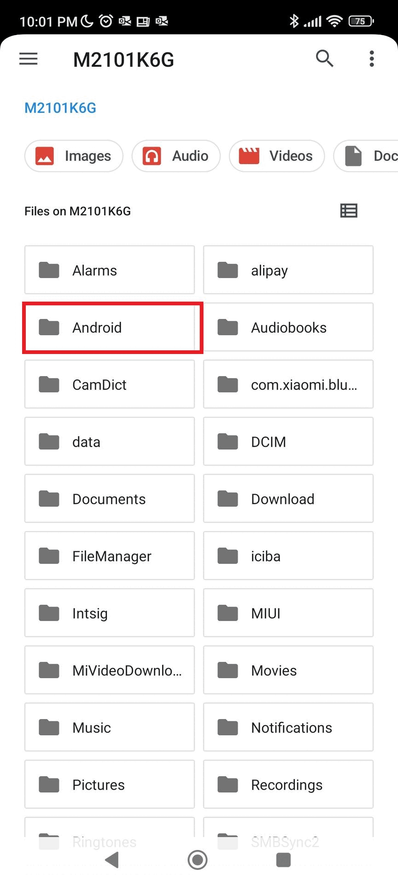|

Since it takes a bit of time to download image file from the Web, you will need to check it's download status asyncrhonously like

```
while (true) {
  ...
  int result = pTunnel->checkResult();
  if (result == 1) {
    // web image downloaded and saved successfully
    ...
    break;
  } else if (result == -1) {
    // failed to download the image
    ...
    break;
  }
  ...
}
```

When the image downloaded and saved successfully, you can draw it to a graphical DD layer like

```
pLayer->drawImageFileFit("downloaded.png");
```

For a complete sample, please refer to the sample sketch https://github.com/trevorwslee/Arduino-DumbDisplay/blob/master/samples/webimage/webimage.ino 


In addition to download image from the Web, you can invoke UI to pick image from your phone:
```
void setup() {
  ...
  pTunnel = dumbdisplay.createImageDownloadTunnel("", "downloaded.jpg");
  ...
}
void loop() {
  ...
  if (triggerUIToPickImage) {
      pTunnel->reconnectTo("pick://);
  }
  ...
}

```
Note that the URL is `pick://`. In such a case, your phone "pick image media UI" will be invoked to pick the image,
rather then downloading from the Web, as `downloaded.jpg`.
If the URL given is `take://`, your phone's camera app will be involed to take picture, as `downloaded.jpg`.


## Save Pictures to Phone Captured with ESP32 Cam

DumbDisplay Arduino Library provides a mechanism to save pictures captured, like with ESP32 Cam, to your Android phone's internal storage, like

```
  camera_fb_t *fb = esp_camera_fb_get();
  ...
  dumbdisplay.saveImage("esp32-cam-captured-image.jpg", fb->buf, fb->len);
```

For a complete sample, please refer to the sample sketch https://github.com/trevorwslee/Arduino-DumbDisplay/blob/master/samples/esp32camddtest/esp32camddtest.ino 

You may also want to watch the YouTube Video ESP32-CAM Experiment -- [**Capture and Stream Pictures to Mobile Phone**](https://www.youtube.com/watch?v=D0tinZi5l5s) -- for a brief description of the experiment.


## Caching Single-bit Bitmap to Phone

A single-bit bitmap image is a common image format for displaying image in Arduino environment. And here in DumbDisplay, such 
image is referred to as pixel image (as opposed to full colored image).

To certain extend, DumbDisplay supports displaying these pixel images to graphical layer as well. 
Two steps are involves:

* The pixel image is transferred to DumbDisplay at initialization time, like

```
// 'phone', 24x24px
const unsigned char phoneBitmap [] PROGMEM = {
  0x00, 0x00, 0x00, 0x00, 0x00, 0x00, 0x00, 0x00, 0x00, 0x3f, 0x81, 0xfc, 0x3f, 0xc3, 0xfc, 0x3f, 
  0xe7, 0xfc, 0x39, 0xe7, 0x9c, 0x38, 0x66, 0x1e, 0x3f, 0xe7, 0xfc, 0x79, 0xe7, 0x9e, 0x78, 0x66, 
  0x1e, 0x7f, 0xe7, 0xfe, 0x39, 0xe7, 0x9c, 0x78, 0x66, 0x1e, 0x7f, 0xe7, 0xfe, 0x3f, 0xe7, 0xfc, 
  0x7f, 0xe7, 0xfc, 0x3f, 0xe7, 0xfc, 0x01, 0xe7, 0x80, 0x00, 0x66, 0x00, 0x00, 0x24, 0x00, 0x00, 
  0x00, 0x00, 0x00, 0x00, 0x00, 0x00, 0x00, 0x00
};
...
void setup() {
  ...
  unsigned char buffer[240];
  display->cachePixelImage("phone.png", PgmCopyBytes(phoneBitmap, sizeof(phoneBitmap), buffer), 24, 24, COLOR_1);
  ...
}
```
Notes:
* If *PROGMEM* is used to mark the byte array, `PgmCopyBytes()` reads the bytes view `pgm_read_byte`
* You you will need to `#include "pgm_util.h"` to use `PgmCopyBytes()`

Under the hook, the pixel image is actually converted to, say in this case, PNG format.
* The cached pixel image is displayed to graphical layer as needed, like
```
  ...
  display->drawImageFile("phone.png", 0, 0); 
  ...
```
Notice how the previously mentioned display image file command is used here.


|  |  |
|--|--|
|For a complete example, and much more than just displaying bitmap image, please refer to my adaption of the "Pocket Computer" Arduino Nano project I found in YouTube -- [Arduino Pocket Computer featuring calculator, stopwatch, calendar, game and phone book](https://www.youtube.com/watch?v=NTaq6f7NV5U) by Volos Projects|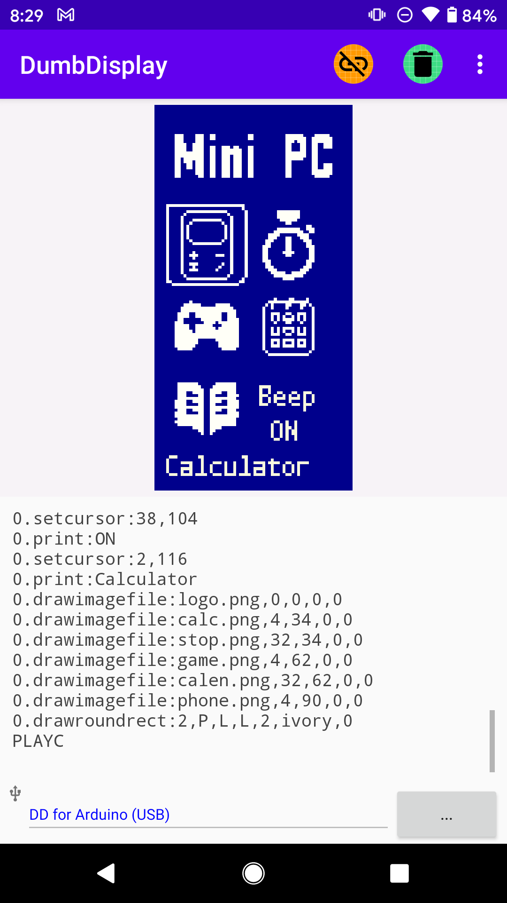|


## Caching 16-bit Colored Bitmap to Phone

Not only can you cache single-bit bitmap to your phone, you can cache 16-bit (5-6-5) colored bitmap to your phone, like
```
  const uint16_t rocket[] PROGMEM = { ... };
  ...
  void setup() {
    ...
    display->cachePixelImage16("rocket.png", rocket, 24, 12);
    ...
  }
```
The cached 16-bit pixel image is displayed to graphical layer as needed, like
```
  ...
  display->drawImageFile("rocket.png", 0, 0); 
  ...
```

|  |  |
|--|--|
|In fact, I guess a better strategy will be to download the needed images, and use it in your sketch, as demonstrated by my post [Adaptation of "Space Wars" Game with DumbDisplay](https://www.instructables.com/Adaptation-of-Space-Wars-Game-With-DumbDisplay/).|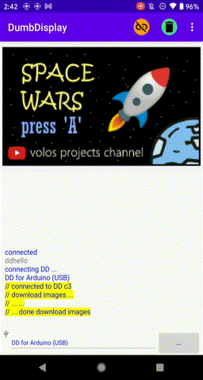|


## Saving Images to DumbDisplay App

Better than sending image data from microcontroller to DumbDisplay app every time, you may want to save the images to DumbDisplay app image storage, for the use by your sketch. As hinted by the post, the steps can be like
|  |  |
|--|--|
|1) use your phone's Chrome browser to open the image page; <br>2) long press the image to bring up the available options; <br>3) select to share the image with DumbDisplay app|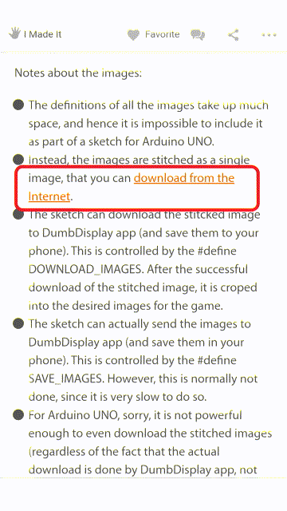|

Notes:
* not only from Chrome, you can share and save images from any app that can share images that it sees
* images saved to DumbDisplay app's image storage will always be PNG; hence when asked for image name, you don't need the ".png" extension
* you can use a file manager to navigate to the image storage; hints: the path is something like `/<main-storage>/Android/data/nobody.trevorlee.dumbdisplay/files/Pictures/DumbDisplay/`


## Audio Supports 

|  |  |
|--|--|
|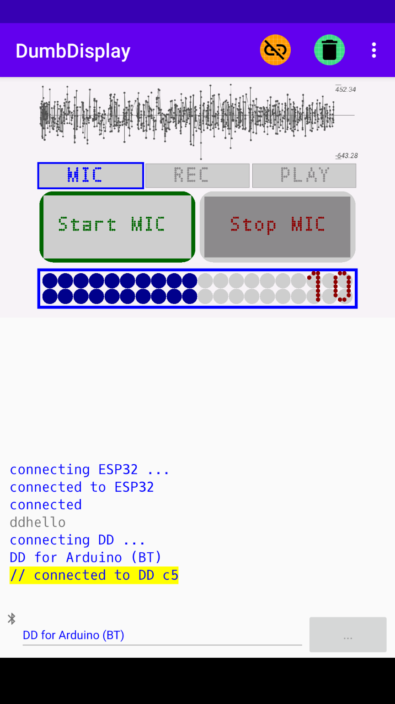|DumbDisplay has certain supports of Audio as well. You may want to refer to [ESP32 Mic Testing With INMP441 and DumbDisplay](https://www.instructables.com/ESP32-Mic-Testing-With-INMP441-and-DumbDisplay/) for samples on DumbDisplay audio supports. Additionally, you may also be interested in a more extensive application -- [Demo of ESP-Now Voice Commander Fun With Wit.ai and DumbDisplay](https://www.youtube.com/watch?v=dhlLU7gmmbE)|


## Retrieving Image Data to Microcontroller

The "tunne" `ImageRetrieverDDTunnel` can be used to retrieve image, saved to DumbDisplay app storage, to you microcontroller, like

```
ImageRetrieverDDTunnel* imageRetrieverDDTunnel = NULL;
void setup() {
    imageRetrieverDDTunnel = dumbdisplay.createImageRetrieverTunnel();
    imageRetrieverDDTunnel->reconnectForJpegImage("test.jpg", 240, 240);
}
void loop() {
  DDJpegImage jpegImage;
  if (imageRetrieverDDTunnel->readJpegImage(jpegImage)) {
    ... e.g. ...
    drawArrayJpeg(dumbdisplay, jpegImage.bytes, jpegImage.byteCount, 0, 0);
  }
}
```

Note that retrieving image using `ImageRetrieverDDTunnel` is fesible if the connect is fast and stable enough, like using WIFI, or Serial connect of certain microcontroller board like Raspberry Pi Pico. 

|  |  |
|--|--|
|As a reference, you may want to refer to the post -- [Simple Arduino Framework Raspberry Pi Pico / ESP32 TFT LCD Photo Frame Implementation With Photos Downloaded From the Internet Via DumbDisplay](https://www.instructables.com/Simple-Arduino-Framework-Raspberry-Pi-Pico-ESP32-T/)||


## "Passive" Connection

What has been described previously is more or less "active" in that DumbDisplay will need to establish connection with DumbDisplay app before the sketch flow can proceed.

Say, when you create a layer in the `setup()` block, it blocks implicitly until an connection is established. Moreover in some cases, you may even want to deliberately call DumbDisplay object's `connect()` method to explicitly block for connection.

After a connection is established however, DumbDisplay is "coorporative" in that only certain calls, like sending layer commands or checking for "feedbacks", will steal some time slices for DumbDisplay's internal working. Note that you explicitly give DumbDisplay time slices by calling `DDDelay()` / `DDYield()`.

Nevertheless, in some use cases, you may not want this "active" behavior. In deed, you can "passively" drive DumbDisplay to make connection with DumbDisplay app.

Let's take the Arduino IDE example basic *blink* sketch, and modify it to add yet another virtual blinking LED on DumbDisplay app (if it is connected)

Here is the original *blink* sketch:

```
void setup() {
  pinMode(LED_BUILTIN, OUTPUT);
}
void loop() {
  digitalWrite(LED_BUILTIN, HIGH);
  delay(1000);                     
  digitalWrite(LED_BUILTIN, LOW); 
  delay(1000);                     
}
```

The modified sketch can be like

```
#include "dumbdisplay.h"
DumbDisplay dumbdisplay(new DDInputOutput());
LedGridDDLayer *led = NULL;
void setup() {
  pinMode(LED_BUILTIN, OUTPUT);
}
void loop() {
  if (dumbdisplay.connectPassive()) {
    if (led == NULL) {
      dumbdisplay.recordLayerSetupCommands();
      led = dumbdisplay.createLedGridLayer();
      dumbdisplay.playbackLayerSetupCommands("blink");
    }
    led->toggle();
  }
  digitalWrite(LED_BUILTIN, HIGH);
  delay(250);                     
  digitalWrite(LED_BUILTIN, LOW); 
  delay(250);                     
}
```
Notice:
* The global DumbDisplay object `dumbdisplay` is still defined the normal way
* A DD layer `led` is declare globally. Note that `led` is initially assigned `NULL`
* No DD layers creation etc in the `setup()` block
* At the beginning of the `loop()` block, `dumbdisplay` is given a chance to "passively" make connection with DumbDisplay app "non-block", by calling `connectPassive()`.
* If connection established, i.e. `connectPassive()` returns `true`
  * Check `led` to see if it is still `NULL` (i.e. nothing created and assigned to it). If so, create DD layer `led` the normal way. Notice how `recordLayerSetupCommands()` and `playbackLayerSetupCommands()` are called so that reconnect after connection lost is possible (as mentioned in previous section [Survive DumbDisplay App Reconnection](#survive-dumbdisplay-app-reconnection)).
  * In any case, toggle `led`
* After giving a chance for DumbDisplay to make connection "passively", blink `LED_BUILTIN` -- turn it ON then OFF.
* ***Do notice that the delay here is 250!*** The delay needs be brief since `connectPassive()` should not be called too infrequently -- at least 1 or 2 times a second   

There is a *helper* class `DDReconnectPassiveConnectionHelper` that can aid programming such *reconnecting* "passive" connection.
Say, the above can be written as
```
#include "dumbdisplay.h"
DumbDisplay dumbdisplay(new DDInputOutput());
DDReconnectPassiveConnectionHelper pdd(dumbdisplay, "blink");
LedGridDDLayer *led = NULL;
void setup() {
  pinMode(LED_BUILTIN, OUTPUT);
}
void loop() {
  pdd.loop([](){
    led = dumbdisplay.createLedGridLayer();
  }, [](){
    led->toggle();
  });
  digitalWrite(LED_BUILTIN, HIGH);
  delay(250);                     
  digitalWrite(LED_BUILTIN, LOW); 
  delay(250);                     
}
```
Notice the pattern of calling `pdd.loop()`:
```
  pdd.loop([](){
    // **********
    // *** initializeCallback ***
    // **********
    ...
  }, [](){
    // **********
    // *** updateCallback ***
    // **********
    ...
  });
```
Also note that `[](){...}` is simply a C++ lambda expression that accepts no parameters and return no value.
If you need it to acess local variables, you can try "capturing" like `[&](){...}`

### "Passive" Connection with "Master Reset"

Instead of relying on reconnection, you may choose to "master reset" DumbDisplay to ground-zero, and "passively" wait for connection afresh. To do so, the above sketch need be modified like

```
...
void loop() {
  DDConnectPassiveStatus connectStatus;
  if (dumbdisplay.connectPassive(&connectStatus)) {
    if (connectStatus.reconnecting) {
        dumbdisplay.masterReset();
        led = NULL;
    } else {
      if (led == NULL) {
        led = dumbdisplay.createLedGridLayer();
      }
      led->toggle();
    }
  }
  ...
}
```

Notice:
* A `connectStatus` structure is passed to `connectPassive()` in order to receive more info about the connection status.
* In case the connection status is reconnecting (i.e. connection lost), "master reset" `dumpdisplay` by calling `masterReset()`
* Note that after "master reset", the layers / tunnels created will not be valid anymore. See that `led` is set be to `NULL` to indicate that `led` need be created up on connected again


For this ***recommended*** way of "passive" connection, there is a *helper* class `DDMasterResetPassiveConnectionHelper` that can aid in programming the flow. Say, the above can be written as
```
#include "dumbdisplay.h"
DumbDisplay dumbdisplay(new DDInputOutput());
DDMasterResetPassiveConnectionHelper pdd(dumbdisplay);
LedGridDDLayer *led = NULL;
void setup() {
  pinMode(LED_BUILTIN, OUTPUT);
}
void loop() {
  pdd.loop([](){
    led = dumbdisplay.createLedGridLayer();
  }, [](){
    led->toggle();
  });
  digitalWrite(LED_BUILTIN, HIGH);
  delay(250);                     
  digitalWrite(LED_BUILTIN, LOW); 
  delay(250);                     
}
```
Notice that calling of `pdd.loop()` is similar, but with one addition optional `NULL`-able `disconnectedCallback`
```
  pdd.loop([](){
    // **********
    // *** initializeCallback ***
    // **********
    ...
  }, [](){
    // **********
    // *** updateCallback ***
    // **********
    ...
  }, [](){
    // **********
    // *** disconnectedCallback ***
    // **********
  });
```

|  |  |
|--|--|
|For a complete program / sketch that demonstrates how "passive" connetion is used, you may want to refer to the post [Extending a TFT_eSPI Example With TTGO T-Display Using PlatformIO, With DumbDisplay](https://www.instructables.com/Extending-a-TFTeSPI-Example-With-TTGO-T-Display-Us/)|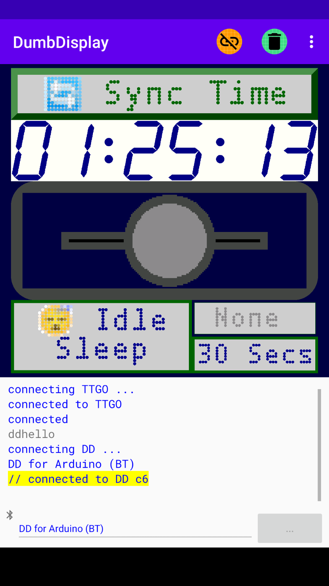|
|The above mentioned post -- [Simple Arduino Framework Raspberry Pi Pico / ESP32 TFT LCD Photo Frame Implementation With Photos Downloaded From the Internet Via DumbDisplay](https://www.instructables.com/Simple-Arduino-Framework-Raspberry-Pi-Pico-ESP32-T/) -- also demonstrates the use of `DDMasterResetPassiveConnectionHelper` for managing connection, disconnection and re-connecting of DumbDisplay Android app.||


## Layer Level Support

Some specific layer inherited from [`MultiLevelDDLayer`](https://trevorwslee.github.io/ArduinoDumbDisplay/html/class_multi_level_d_d_layer.html) --
namely, [`GraphicalDDLayer`](https://trevorwslee.github.io/ArduinoDumbDisplay/html/class_graphical_d_d_layer.html) -- can have multiple named layer levels of canvas on which you draw.

The concept is much like homogenous sub-layering except:
* You have only a single good-old `GraphicalDDLayer` object even it has multiple levels
* To draw on a different layer level, you need to add and switch to it, to make the layer level the current one
* Z-order of the layer levels is just like layers -- the first added (the default one named `DD_DEF_LAYER_LEVEL_ID`) is on the top

Other than the default layer level (`DD_DEF_LAYER_LEVEL_ID`) added automatically, you add new layer level like
```
  ...
  graphical = dumbdisplay->createGraphicalLayer(500, 500);
  ...
  // set layer specific properties that are outside of levels
  graphical->border(2, DD_COLOR_chocolate);
  graphical->backgroundColor(DD_COLOR_azure);
  graphical->enableFeedback("fs");
  ...
  // add a new level, switch to it, and draw on it
  graphical->addLevel("simple-level");
  graphical->switchLevel("simple-level");
  graphical->levelOpacity(50);
  graphical->drawRect(10, 10, 480, 480, "red", true);
  graphical->setCursor(15, 15);
  graphical->write("This is the 'simple-level' level!", true);
  ...

```

|  |  |
|--|--|
|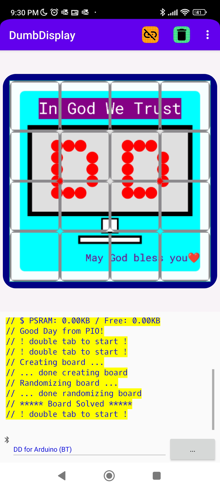|For more on the various features of layer level, you might want to refer to the included example [`sliding_puzzle`](https://github.com/trevorwslee/Arduino-DumbDisplay/blob/master/examples/sliding_puzzle/sliding_puzzle.ino) which uses a single `GraphicalDDLayer` layer and lots of layer levels to realize a simple Sliding Puzzle game created on-the-fly with the default DumbDisplay logo `PNG` file plus some drawings and texts.|


# Reference

For reference, you may want to resort to the headers of the different related classes. To better display the headers, [Doxygen](https://www.doxygen.nl/index.html) is used to generate doc HTML pages autmoatically -- https://trevorwslee.github.io/ArduinoDumbDisplay/html/


# DumbDisplay WIFI Bridge

Very likely you will be using your desktop computer (say Windows) for Arduino development, which will be connecting to your microcontroller via Serial connection. Wouldn't it be nice to be able to connect to DumbDisplay similarly, via the same Serial wiring as well?

Yes, you can achieve similar effect, with the help of the simple DumbDisplay WIFI Bridge Python program -- `tools/DDWifiBrideg/DDWifiBridge.py`. DumbDisplay WIFI Bridge acts as a "bridge" / "proxy" between your microcontroller (Serial connection) and your mobile phone (WIFI connection). 

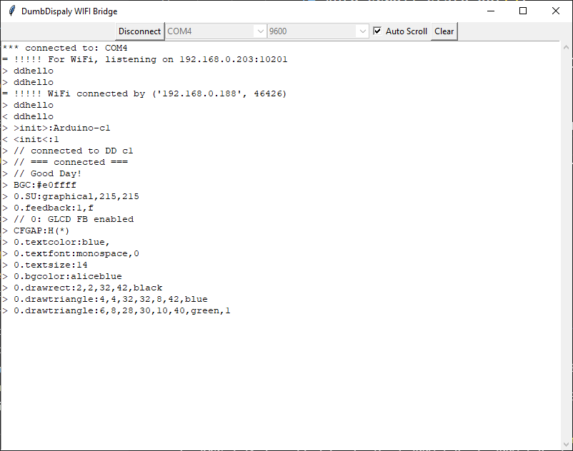

When running the DumbDisplay WIFI Bridge, on one side, it connects to your microcontroller board via Serial connection, similar to how you Arduino IDE connect to your microcontroller board. At the same time, it listens on port 10201 of your desktop, allowing DumbDisply to establish connection via WIFI. In other words, your desktop computer port 10201 is now a "bridge" / "proxy" to your sketch (with DumbDisplay). 

Notes:
* There is also a seperate repository for DumbDisply WIFI Bridge -- https://github.com/trevorwslee/DDWifiBridge 
* DumbDisply WIFI Bridge makes use of the PySerial library, which can be install like
  ```
  pip install pyserial
  ```
* In Linux, acessing serial port will need special access right; you can grant such right to yourself (the user) like
  ```
  sudo usermod -a -G dialout <user>
  ```  
* My own experience is that using a slower serial baud rate (like 57600 or even lower like 9600) will make the connection more stable.
* ***If DumbDisplay fails to make connection to DumbDisplay WIFI Bridge, check your descktop firewall settings; try switching desktop WIFI to use 2.4 GHz.***  


For example, when sketch like the above Graphical [LCD] example is run with DumbDisplay WIFI Bridge as well as an Android emulator (e.g. [Genymotion](https://www.genymotion.com/)), you can see something like:

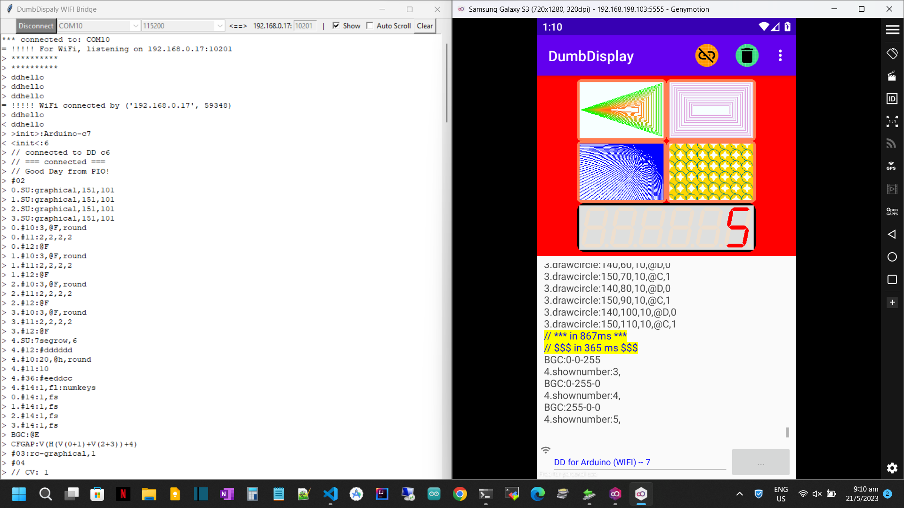

You may want to watch the video [**Bridging Arduino UNO and Android DumbDisplay app -- DumbDisplayWifiBridge**](https://www.youtube.com/watch?v=0UhRmXXBQi8)


# DumbDisplay App Hints

* Many command parameters sent will be encoded for compression, and will look a bit cryptic (when shown on DumbDisplay app terminal view). If you want to disable parameter encoding, define `DD_DISABLE_PARAM_ENCODING` before including `dumbdisplay.h`, like

  ```
  #define DD_DISABLE_PARAM_ENCODING
  #include "dumbdisplay.h"
  DumbDisplay dumbdisplay(new DDInputOutput());
  ```

  Note that include header files like `ssdumbdisplay.h` actually in turn includes `dumbdisplay.h`

* In fact, showing commands on DumbDisplay app may slow things down, even makes your DumbDisplay app non-responsive (like freeze), especially when commands are sent in fast succession. Hence, suggest to disable DumbDisplay app's `Show Commands` option.

* On the contrary, if you do have some info, like that logged with `writeComment()`, that you have to jog down for whatever reason,
  you can share the Terminal's text with the command "Share Terminal Text"

* Setting DumbDisplay app's `Pixel Density` to **Medium** will make the layer's text and other aspects look better. Setting it to **High** or even **Fine** would be very taxing to your phone. If want better looking text but don't want to pay the price, try setting it to **Over**. In fact, **Over** is ***recommended*** if **Normal** doesn't look good to your; however, since text rendering is "native", text might look sligtly "over" the boundary where it should be (but looks better) 

|**Normal**|**Medium**|**High**|**Fine**|**Over**|
|--|--|--|--|--|
|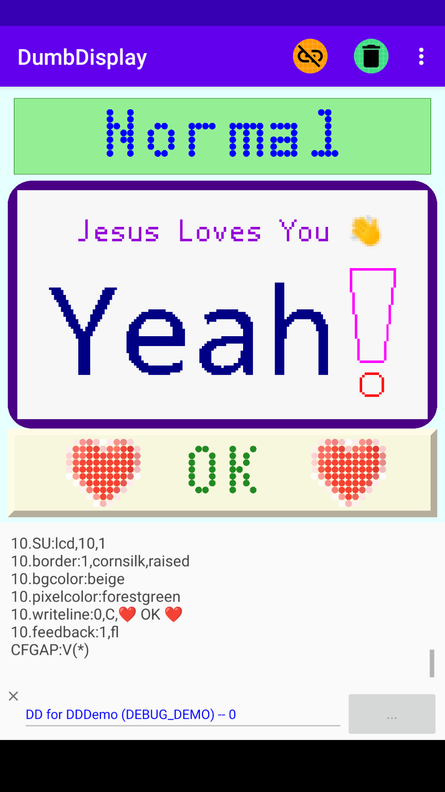|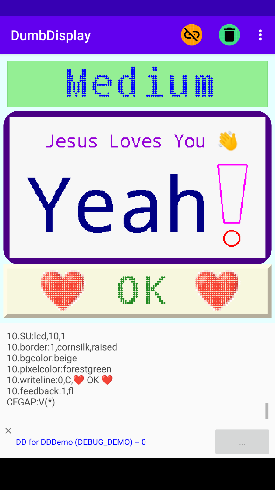|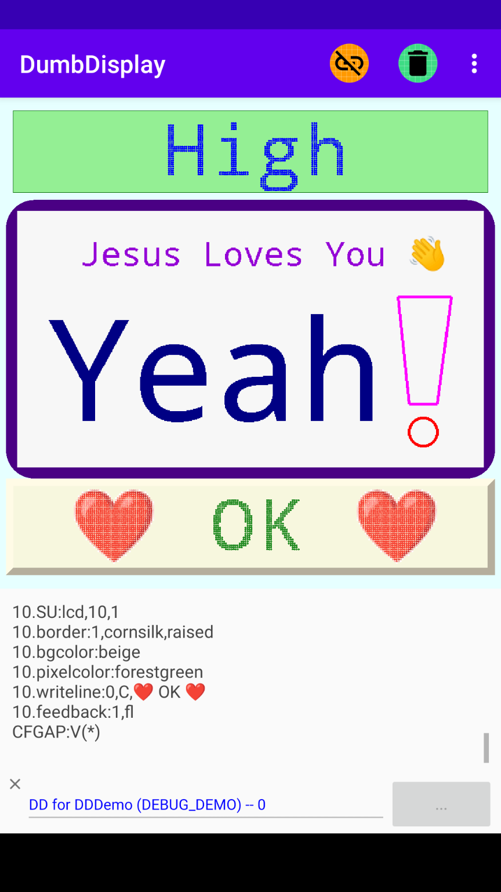|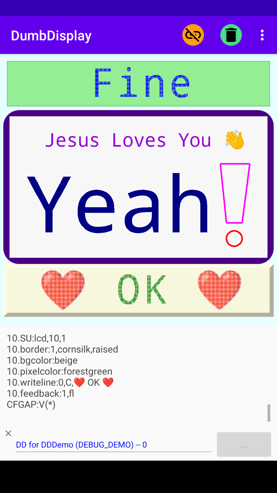|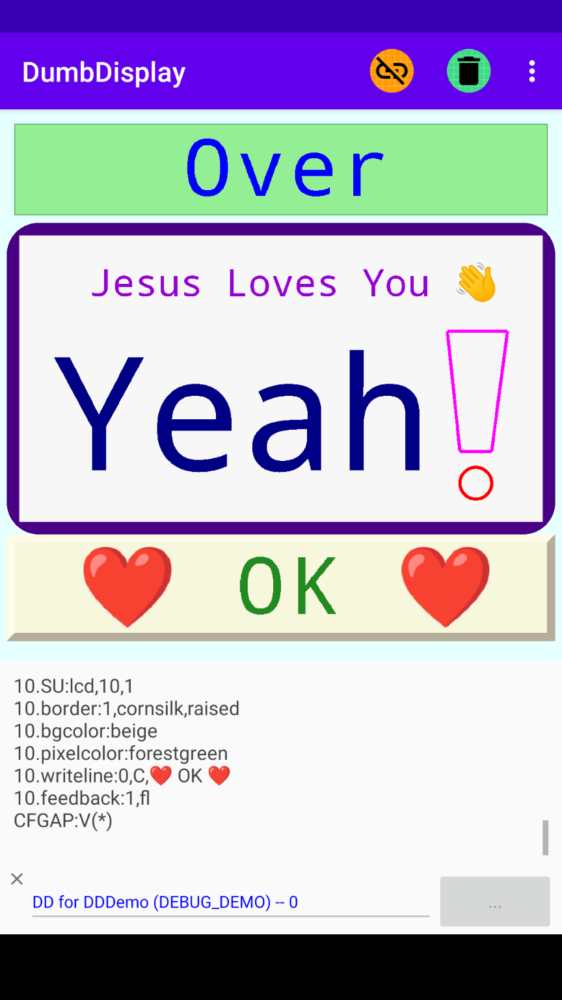|


* You can drag the bottom left/right side of the DumbDisplay canvas to have it resized.
* You can pinch-zoom the DumbDisplay canvas to resize it as well, if `Zoom Mode` is set to *ZOOM*. BTW, with `Zoom Mode` set to *ZOOM*, pinch-zooming the DumbDisplay canvas will zoom it (the layers). When it is zoomed, it will not produce any "feedback". You double-click the canvas to return it to normal size.
* You may want to set `Zoom Mode` to *DISABLED*. If disabled, action like moving virtual joystick "feedback" can be simultaneous with other "feedback" like clicking (like using both hands for dragging and clicking).
* You can long press the terminal view to disable it's autoscrolling. BTW, terminal view has the `Keep Lines` limit, which you set with the `Setting` page. And this `Keep Lines` can certainly affect how much memory DumbDisplay will be used, should you have so many lines to be display by the terminal view.
* When DumbDisplay app is connected and is in the foreground, your phone will not go to sleep. If DumbDisplay is put to the background, connection will still be kept.


# Startup DumbDisplay App from Another Android App

Due mostly to technical considerations, DumbDisplay Android app supports starting from another Android app, enabling some ***preferred*** customizations that best fit different microcontroller programming use cases.

Starting DumbDisplay app from another app can be as simple as starting an `Activity` with some special URL like `nb.tl.dd://MyApp?maximized&noTerminal`

For example, in Kotlin

```
val intent = Intent(Intent.ACTION_VIEW)
val data = Uri.parse("nb.tl.dd://MyApp?mustConnect&noTerminal&registerDeviceInfo=ESP32@192.168.0.10&deviceTypes=WIFI")
intent.setData(data)
startActivity(context, intent, null)
```

Notice the customization options as the parameters to the URL:
- Name of the app, in various places -- `MyApp` as in the above URL; can be other values
  - *preference* name for saving settings
  - media storage folder name
  - title on title bar
- Maximize the display -- `maximized`
- Hide the terminal view altogether -- `noTerminal`
- Fix orientation -- `orientation`
  - `PORTRAIT`
  - `LANDSCAPE`
- Automatially hide status bar once connected to *device* -- `autoHideStatus`
- Must make connection without needing user to click the *connect* icon -- `mustConnect` -- always `true` if `maximized`
- Do not use storage for media (and hence do not ask for permission) -- `noStorage`
- Register a WIFI *device* -- `registerDeviceInfo`
  <br>
  e.g. `registerDeviceInfo=ESP32@192.168.0.10`
  - `ESP32` is the *device* name
  - `192.168.0.10` is the *device* IP
- Automatically select the registered *device* (`registerDeviceInfo`) -- `autoSelectRegisteredDevice`  
- Specify what *device types* can be selected (if not `autoSelectRegisteredDevice`) -- `deviceTypes`
  - `WIFI` -- WIFI
  - `BT` -- Bluetooth
  - `LE` -- BLE
  - `USB` -- USB
  - `DEMO`
- Display canvas alignment -- `alignment`
  - `CENTER`
  - `LEFT`
  - `TOP`
  - `LEFT_TOP`
- Display canvas *pixel density* -- `pixelDensity`
  - `NORMAL`
  - `MEDIUM`
  - `HIGH`
  - `FINE`
  - `OVER`    


A complete sample React Native app can be like

```
import { Button, Linking, StyleSheet, Text, View } from 'react-native';
export default function App() {
  const handleMCNT = () => {
    console.log('* handleMCNT');
    Linking.openURL('nb.tl.dd://MyApp?mustConnect&noTerminal&deviceTypes=DEMO')    
  }
  return (
    <View style={styles.container}>
      <Button
        title="must connect with no terminal"
        onPress={handleMCNT}/>
    </View>
  );
}
const styles = StyleSheet.create({
  container: {
    flex: 1,
    backgroundColor: '#fff',
    alignItems: 'center',
    justifyContent: 'center',
  },
});
```

If you want to, you can try the above React Native code with the help of [Snack Expo](https://snack.expo.dev/)
* Assume you have [Expo](https://play.google.com/store/apps/details?id=host.exp.exponent&hl=en_US) and [DumbDisplay](https://play.google.com/store/apps/details?id=nobody.trevorlee.dumbdisplay) Android apps installed
* Click <a href="https://snack.expo.dev/?code=import%20%7B%20Button%2C%20Linking%2C%20StyleSheet%2C%20Text%2C%20View%20%7D%20from%20%27react-native%27%3B%0Aexport%20default%20function%20App%28%29%20%7B%0A%20%20const%20handleMCNT%20%3D%20%28%29%20%3D%3E%20%7B%0A%20%20%20%20console.log%28%27%2A%20handleMCNT%27%29%3B%0A%20%20%20%20Linking.openURL%28%27nb.tl.dd%3A%2F%2FMyApp%3FmustConnect%26noTerminal%26deviceTypes%3DDEMO%27%29%20%20%20%20%0A%20%20%7D%0A%20%20return%20%28%0A%20%20%20%20%3CView%20style%3D%7Bstyles.container%7D%3E%0A%20%20%20%20%20%20%3CButton%0A%20%20%20%20%20%20%20%20title%3D%22must%20connect%20with%20no%20terminal%22%0A%20%20%20%20%20%20%20%20onPress%3D%7BhandleMCNT%7D%2F%3E%0A%20%20%20%20%3C%2FView%3E%0A%20%20%29%3B%0A%7D%0Aconst%20styles%20%3D%20StyleSheet.create%28%7B%0A%20%20container%3A%20%7B%0A%20%20%20%20flex%3A%201%2C%0A%20%20%20%20backgroundColor%3A%20%27%23fff%27%2C%0A%20%20%20%20alignItems%3A%20%27center%27%2C%0A%20%20%20%20justifyContent%3A%20%27center%27%2C%0A%20%20%7D%2C%0A%7D%29%3B">here</a> to head to Snack Expo with the React Native code.
Alternatively, you can directly go to [Snack Expo](https://snack.expo.dev/) and replace the content of the file `App.js` there with the above React Native code
* Select `My Device`

* Click the button `must connect with no terminal` shown


# Thank You!

Greeting from the author Trevor Lee:

> Peace be with you!
> May God bless you!
> Jesus loves you!
> Amazing Grace!


# License

MIT


# Change History


v0.9.9-r51
   - added "take picture" for "download tunnel"

v0.9.9-r50
  - support of "root" layer 
  - support of "grid" layout
  - bug fix

v0.9.9-r42
  - bug fix
  - able to work with WiFiManager for ESP32

v0.9.9-r41
  - added SelectionListDDLayer
  - bug fix

v0.9.9-r40
  - added RtspClientDDLayer
  - bug fix

v0.9.9-r34
  - added "layer-level" background (with animate support)
  - enhanced performance a bit
  - bug fix

v0.9.9-r33
  - added "layer-level" support
  - bug fix

v0.9.9-r31
  - added "confirmation feedback"
  - added layer explicit "feedback"
  - added support for "shared storage" for images
  - bug fix

v0.9.9-r30
  - added DumbDisplayWindowDDLayer
  - added DDLayer "blend"
  - bug fix

v0.9.9-r20
  - enhanced "generalServiceTunnel"
  - enhanced JoystickDDLayer
  - enhanced SelectionDDLayer
  - enhanced 'auto pin' layers
  - bug fix

v0.9.9-r10
  - added SelectionDDLayer
  - bug fix

v0.9.9-r04
  - bug fix

v0.9.9-r03
  - add ImageRetrieverDDTunnel
  - bug fix

v0.9.9-r02
  - enhanced reading of "feedback"
  - enabled "passive" connection
  - bug fix

v0.9.9-r01
  - bug fix

v0.9.9
  - added WebViewDDLayer
  - bug fix

v0.9.8-r7
  - added some "footprint" options
  - added "press" "feedback" option
  - bug fix

v0.9.8-r6
  - verified support for Arduino UNO R4 WiFi
  - bug fix

v0.9.8-r5
  - added background color opacity support
  - bug fix

v0.9.8-r4
  - added support for ESP board as WIFI module using AT commands
  - bug fix

v0.9.8-r3
  - bug fix

v0.9.8-r2
  - bug fix

v0.9.8-r1
  - added option for "passive" connection
  - option for virtual joysticks to feedback simultaneously
  - bug fix

v0.9.8
  - enhanced documentation
  - added JoystickDDLayer
  - started to use Doxygen to generate doc HTML
  - bug fix

v0.9.7
  - enhanced graphical layer
  - added dragging "auto repeat" option
  - bug fix

v0.9.6-r3
  - bug fix

v0.9.6-r2
  - enhanced sound support
  - enhanced "auto pin"
  - bug fix

v0.9.6-r1
  - enhanced sound support
  - bug fix

v0.9.6
  - added sound support
  - enhanced JSON "tunnel"
  - bug fix

v0.9.5
  - can save/cache grayscale image
  - added TensorFlow Lite Object Detection Demo tunnel
  - bug fix

v0.9.4
  - enhanced "feedback"
  - can be a "share target" for saving images to storage
  - enhanced graphical layers
  - bug fixes

v0.9.3
  - enhanced graphical layers
  - bug fixes

v0.9.2
  - enhanced 7-segment layers
  - bug fixes

v0.9.1
  - added 'terminal' layer
  - bug fixes

v0.9.0
  - added 'service tunnel'
  - added TomTom map layer
  - big fixes

v0.8.4
  - added layer margin support
  - big fixes

v0.8.3
  - add more options for "JSON Tunnel"
  - bug fixes

v0.8.2
  - add "save image" support, basically for ESP32-Cam board
  - bug fixes

v0.8.1
  - aded "image download tunnel"
  - "JSON tunnel" now supports HTTPs (via Android phone)
  - added load/save/draw image to "graphical layer"
  - bug fixes

v0.8.0
  - added more basic layer functions
  - added more LCD layer functions
  - bug fixes

v0.7.9
  - added more "auto pin" functions
  - added "tone" to DumbDisplay
  - bug fixes

v0.7.7
  - minor changes

v0.7.6
  - added "idle callback"

v0.7.5
  - added auto repeat "feedback" option, which can be used to simulate dragging
  - added plotter layer `PlotterDDLayer`
  - added double-click / long-press "feedback"
  - bug fixes

v0.7.0
  - added ability to reconnect after disconnect
  - added ESP32 BLE connection support

v0.6.3
  - added simple JSON "tunnel" for calling simple Internet REST api
  - DDWifiBridge can now run as command-line tool without UI
  - bug fixes

v0.6.2
  - added capability to store recorded commands to phone
  - bug fixes

v0.6.1
  - added 'tunnel', to access Internet without special board support of WIFI connectivity
  - bug fixes

v0.6.0
  - added 'command buffering', sort of freeze the screen, until played back all at once
  - bug fixes

v0.5.1
- added DumbDispaly WIFI Bridge
- bug fixes

v0.5.0
- added WIFI support

v0.4.2
- added auto "feedback" (e.g. auto flashing of layer)
- added "auto pin" spacer -- DD_AP_SPACER
- added layer border
- adding WIFI support

v0.4.0
- added "layer feedback" mechanism -- i.e. handler "hook" to handle when layer clicked 

v0.1.3
- added 7-Segment-row layer (`SevenSegmentRowDDLayer`)

v0.1.2
- added "graphical" LCD layer (`GraphicalDDLayer`)

v0.1.1
- added ESP32 "experimental" support

v0.1.0
- initial release
